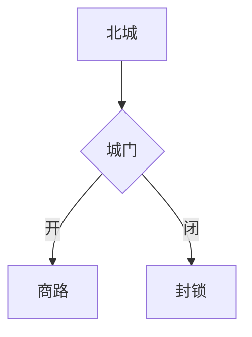

# Obsidian 语法参考（资料正文可用部分）

资料正文可以使用标准 Markdown（标题、加粗、列表、引用、表格、代码块）加上以下 Obsidian 扩展语法。注意：资料链接与 frontmatter 不在本参考范围内——它们由 [../SKILL.md](../SKILL.md) 的契约管理（链接只用 materialLink，绝不写 YAML）。

本文基于 kepano/obsidian-skills 的 obsidian-markdown 技能修剪而来（删除了 wikilink、properties/frontmatter、embeds 章节），许可证与修改说明见 [../NOTICE.md](../NOTICE.md)。

## Callouts

```markdown
> [!note]
> 基本提示块。

> [!warning] 自定义标题
> 带自定义标题的提示块。

> [!faq]- 默认折叠
> 可折叠提示块（- 折叠，+ 展开）。
```

常用类型：`note`、`tip`、`info`、`warning`、`danger`、`example`、`quote`、`faq`/`question`、`success`/`check`、`failure`/`fail`、`bug`、`abstract`/`summary`/`tldr`、`todo`。

提示块可以嵌套：

```markdown
> [!note] 外层
> > [!tip] 内层
> > 嵌套内容。
```

仅 Obsidian 渲染；App 内预览显示原文。

## 标签（不要用于资料正文）

```markdown
#tag                    行内标签
#nested/tag             层级标签
```

标签可含字母、数字（不能开头）、下划线、连字符、斜杠。资料标签由宿主通过工具的 tags 字段管理，资料正文中不要加 `#标签`（详见 SKILL.md 契约）。此处仅列出语法供理解既有笔记。

## 注释

```markdown
可见文本 %%这里被隐藏%% 继续可见。

%%
整段在阅读视图中隐藏。
%%
```

可用来给未来的自己留备注，读者在阅读视图看不到。

## 高亮

```markdown
==重点内容==
```

仅 Obsidian 渲染。

## 数学（LaTeX）

```markdown
行内：$e^{i\pi} + 1 = 0$

块级：
$$
\frac{a}{b} = c
$$
```

## 图表（Mermaid）

````markdown

````

## 脚注

```markdown
正文中的引用[^1]。

[^1]: 脚注内容。

行内脚注。^[这是行内脚注。]
```

## 参考链接

- [Obsidian Flavored Markdown](https://help.obsidian.md/obsidian-flavored-markdown)
- [Callouts](https://help.obsidian.md/callouts)
