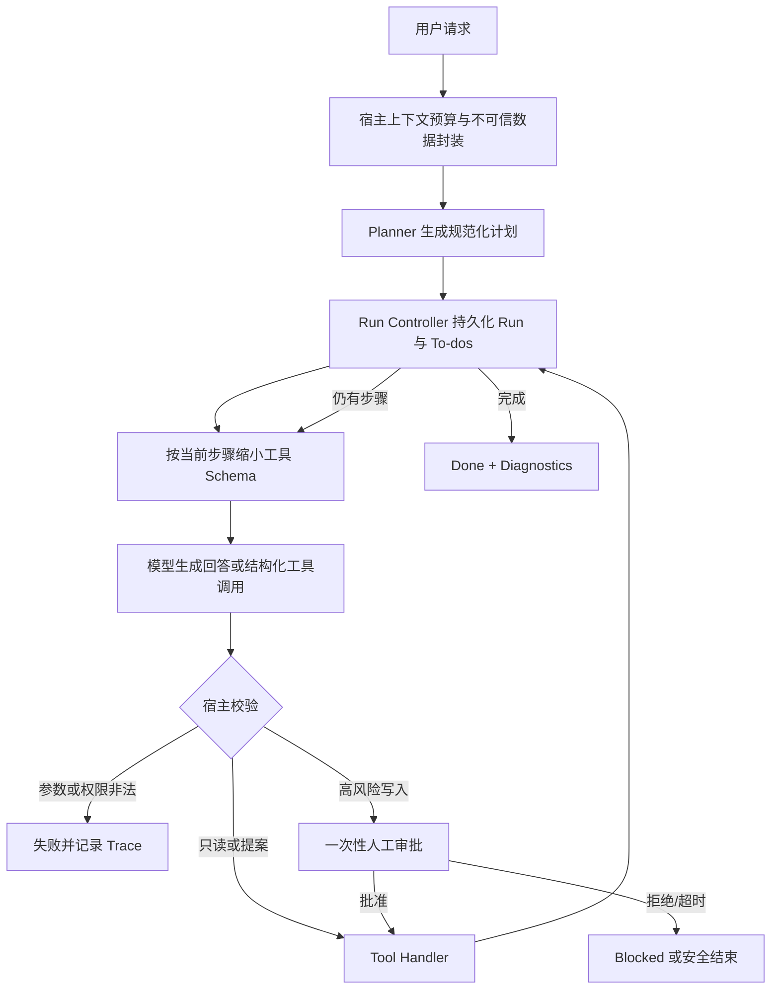

# PurrTypos Agent 最终架构

> 历史状态：本文记录上一轮 Writing Agent 三层架构的完成状态，不再是 2026-08 PurrA/剧本对话重构的权威目标。当前层级所有权、迁移门槛与断线语义以 [`docs/design/purra-screenplay-refactor-charter.md`](design/purra-screenplay-refactor-charter.md) 为准。

## 1. 架构目标

Agent 的核心不是“让模型可以调用工具”，而是让不确定的模型输出进入一个可约束、可观察、可恢复、可评测的宿主执行系统。

## 2. 分层结构

| 层 | 职责 | 主要模块 | 不应承担的职责 |
|---|---|---|---|
| API / Stream | 接收请求、映射 SSE、传播连接中断 | `routers/ai.py`、`application/sse_mapping.py` | 决定工具安全策略 |
| Composition | 装配每次完整 Agent Run | `application/agent_composition.py` | 实现 Core 或 Writing 规则 |
| Request Mapping | 将 HTTP DTO 转为 Core 请求与 Writing 上下文 | `application/request_mapping.py` | 静默丢弃不支持的调用方工具 |
| Core Runtime | 规划、上下文预算、模型轮次、工具循环与终态 | `purra/engine.py`、`purra/runtime.py` | 导入具体写作业务 |
| Core Tool Boundary | Schema、allowlist、批次校验、审批与执行限制 | `purra/tools/` | 相信模型自行遵守权限 |
| Writing Policy | 定义 Planning、工具风险和响应语义 | `domains/writing/` | 依赖 HTTP 或供应商 SDK |
| Writing Infrastructure | 执行具体读写并校验对象归属 | `infrastructure/writing/` | 修改 Core 生命周期 |
| Model Infrastructure | 对接供应商并规范化流式协议 | `infrastructure/models/` | 决定 Writing 语义 |
| Persistence | 持久化 Run、Trace 和 Writing 数据 | `infrastructure/persistence/` | 重新实现状态机 |
| Deterministic Evaluation | 验证历史事故和安全不变量 | `purra/evaluation/`、`domains/writing/evaluation/` | 调用外部模型或改变运行状态 |

## 3. 一次 Agent Run 的数据流

## 4. 三种不同的约束

| 约束 | 面向谁 | 示例 |
|---|---|---|
| 模型可见 Schema | 告诉模型“有哪些能力” | 当前步骤只展示 `getChapterContent` |
| Planner 步骤 allowlist | 告诉执行器“这一步允许哪些工具” | read 步骤不能调用 delete 工具 |
| Tool Policy | 宿主最终安全边界 | `deleteCharacter` 永远需要人工批准 |

三者不能合并。模型看不到某工具不等于后端安全；模型看得到某工具也不等于当前步骤允许执行。

## 5. Run 状态语义

| 状态 | 含义 | 是否系统故障 |
|---|---|---|
| `running` | 正在规划、推理、执行或等待事件 | 否 |
| `done` | 任务正确完成 | 否 |
| `blocked` | 等待/拒绝/业务条件不足，不能继续 | 通常否 |
| `canceled` | 用户断开或主动取消 | 否 |
| `failed` | Planner、模型、工具或安全不变量失败 | 是 |

终态不可被后续异步事件覆盖。断开连接必须持久化 `canceled`，避免僵尸 Run。

## 6. 信任边界

| 输入 | 信任级别 | 防护 |
|---|---|---|
| 用户提示词 | 不可信 | 不直接成为宿主授权 |
| 章节、记忆、大纲 | 不可信数据 | JSON 封装并注入宿主安全说明 |
| 模型文本 | 不可信 | 不从自然语言解析伪工具调用 |
| 模型工具参数 | 不可信 | 严格 JSON、大小限制、作用域校验 |
| 工具名称与调用 ID | 不可信 | allowlist、唯一性、批量上限 |
| 用户批准事件 | 有限信任 | 绑定一次 pending approval，消费后不可重放 |
| 后端 Tool Policy | 权威 | 默认拒绝未分类工具 |

## 7. 上下文策略

总窗口先扣除输出预留和工具 Schema，再由历史、记忆、关联章节/大纲动态申请预算。未使用预算可被其他区域借用。历史裁剪以完整对话轮次为单位。

上下文越多不一定越好。优化顺序是：先删除失败请求、重复轮次和无关 Schema，再考虑裁剪事实内容。

## 8. 确定性评测

| 信号 | 回答的问题 |
|---|---|
| 单元/集成测试 | 代码契约是否仍成立 |
| Runtime Regression | 历史事故是否重新出现 |
| Security Red Team | 宿主安全边界是否仍成立 |
| Performance Report | 慢和贵发生在哪里 |

## 9. 必须长期保持的不变量

1. 模型可见工具与后端 handler 必须契约一致。
2. 后端执行权限不能只依赖提示词或 Schema 隐藏。
3. 未分类工具不得启动或执行。
4. 高风险持久化操作必须经过一次性用户批准。
5. 工具参数解析失败必须 fail closed。
6. ID 型写操作必须校验目标属于当前书籍。
7. 不可信上下文不能改变工具权限或批准状态。
8. 每个 Run 必须绑定 `run_id`，并记录 provider、model、context window、endpoint digest 和 request profile digest。
9. `blocked`、`canceled`、`failed` 必须保持不同语义。
10. 安全回归必须使代码验收失败，而不是被平均质量分抵消。

## 10. 当前已知边界

- Approval Broker 和供应商能力缓存是进程内状态；重启后安全失败关闭或重新探测。
- Token 数据目前包含工程估算，不等同于供应商账单 usage。
- 仓库不再包含新旧路径双轨 Pilot、人工评分或自动发布决策模块。
- Prompt Injection 无法仅靠提示词完全消除，真正安全边界仍是宿主 allowlist、对象归属和人工审批。
