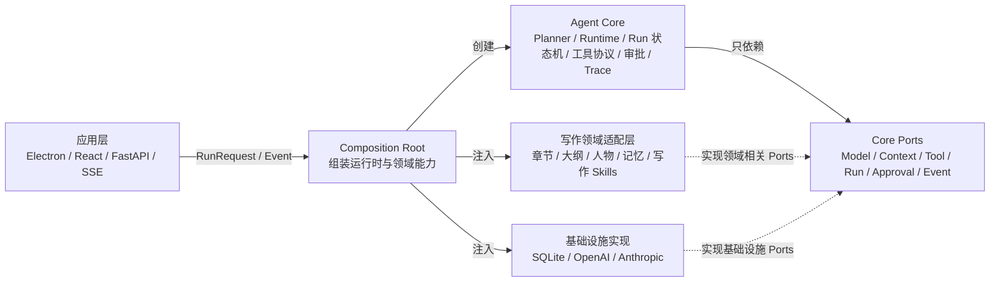

# PurrTypos Agent Core 三层架构改造计划

> 状态：实施中（**通用 Agent Core 已完成独立运行门禁**；写作领域迁移、应用层接线、真实 Pilot/性能对比仍待后续阶段完成）<br>
> 目标：在不改变现有用户体验和 Agent 能力的前提下，将当前 Agent 拆分为通用运行内核、写作领域适配层和应用层。<br>
> 实施方式：同仓库、同 Python 进程内渐进迁移；本阶段不拆成远程微服务。

---

## 1. 最终目标

改造完成后，项目形成三个清晰的业务层次：



这里的“基础设施实现”不是第四个产品层，而是三层架构中各类抽象接口的具体实现。

最终依赖方向必须满足：

```text
应用层 / Composition Root ─→ Agent Core
应用层 / Composition Root ─→ 写作领域适配层
应用层 / Composition Root ─→ 基础设施实现
Agent Core ────────────────→ Core 内定义的抽象接口（Ports）
写作领域适配层 ───────────→ 实现领域相关 Ports
基础设施 ─────────────────→ 实现基础设施 Ports
```

上图中的“实现”是依赖反转关系，不表示 Core 导入领域模块。Agent Core 不得反向依赖 FastAPI、Electron、React、SQLite 或 `domains.writing`，也不得知道书籍、章节、人物、大纲等业务概念。

## 2. 改造范围与非目标

### 2.1 本次要完成

- 把模型多轮循环从 FastAPI 路由中提取到 Agent Runtime。
- 把 Run、Planner、工具执行、审批、事件和 Trace 统一为通用协议。
- 将数据库、模型供应商、事件发送、审批和上下文构建改为依赖注入。
- 将章节、大纲、人物、世界设定、长期记忆等能力收拢到写作领域适配层。
- 建立唯一 Composition Root，显式组装 Runtime、Writing Adapter、Repository、Model Gateway、Approval Broker 和 Event Sink。
- 保持现有 API、SSE 事件、数据库数据和前端交互兼容。
- 建立结构回归、真实 Pilot 和性能对比，证明拆分没有造成效果退化。

### 2.2 本次暂不完成

- 不立即拆成独立仓库。
- 不立即发布为独立 Python 包。
- 不把 Agent Core 部署为远程微服务。
- 不重写 React 聊天界面。
- 不借架构改造同时重新设计所有工具或数据库表。
- 不为了“通用”而删除 PurrTypos 的写作提示词、上下文或记忆能力。

## 3. 当前基线与主要耦合点

当前项目已经具备较完整的 Agent 能力，但仍集中在 `backend/services` 和 `backend/routers/ai.py` 中。

| 当前能力 | 现有位置 | 目标归属 |
|---|---|---|
| 模型多轮循环、工具续接、断连处理 | `backend/routers/ai.py` | Agent Core Runtime；路由只做协议转换 |
| Planner 与计划校验 | `backend/services/task_planner*.py` | Agent Core |
| Run 状态机与 To-dos | `backend/services/agent_run_controller.py` | Agent Core |
| Run 的 SQLite SQL | `backend/services/agent_run_store.py` | SQLite Repository 实现 |
| 工具注册、契约、安全与审批 | `backend/services/tool_*.py` | 通用机制进入 Core，写作策略进入 Domain |
| 章节、人物、大纲等 handler | `backend/services/tool_handlers/*` | 写作领域适配层 |
| 写作 Skills | `backend/skills/*` | 写作领域适配层 |
| 上下文 Token 预算 | `backend/utils/context_budget.py` | Agent Core |
| 章节、大纲、记忆组装 | `backend/utils/chat_preflight.py`、Memory Services | 写作领域适配层 |
| OpenAI/Anthropic 调用 | `backend/services/*_chat.py` | Model Gateway 实现 |
| 启动时 Skills 装载与契约校验 | `backend/main.py`、`tool_router.py`、`tool_contract.py` | Composition Root + Core 契约校验 |
| SSE、请求校验、HTTP 错误 | `backend/routers/ai.py`、`backend/schemas/ai.py` | 应用层 |
| 审批卡片、聊天时间线 | `src/Workspace/AiPanel/*` | 应用层 |

需要解除的关键耦合：

1. `ChatStreamRequest` 直接暴露 `bookId`、`chapterId` 等写作字段。
2. Planner 是否启动依赖 `book_id`。
3. `AgentRunController` 直接接收具体数据库连接。
4. `tool_executor` 通过导入写作 handler 完成全局注册。
5. handler 和记忆服务直接调用全局 `get_db()`。
6. `routers/ai.py` 同时负责 HTTP、上下文、Planner、模型循环、工具执行和 Run 终态。
7. Skills 缓存、handler 注册表、审批 Broker 和供应商能力缓存包含进程级全局状态，需要由 Composition Root 明确管理生命周期。
8. 工具批次共享可变 `ctx`，创建章节等操作会更新当前章节、目录和缓存；迁移时必须保留同一 Run 内的状态一致性和缓存失效语义。

## 4. 目标目录结构

第一阶段建议保持在现有 `backend` 中：

```text
backend/
├── agent_core/
│   ├── __init__.py
│   ├── engine.py             # 唯一高层入口：Planner → Context → Runtime → 终态
│   ├── contracts.py          # RunRequest、RunResult、ToolCall、ContextBundle
│   ├── events.py             # Core Event 定义
│   ├── errors.py             # 领域无关错误
│   ├── cancellation.py       # 模型、工具、审批的统一取消竞态
│   ├── json_values.py        # 不可绕过的深层只读 JSON 边界
│   ├── ports.py              # Repository、Model、Context、Tool、Planning、Approval、Event 接口
│   ├── runtime.py            # 模型/工具多轮运行循环
│   ├── planner.py            # 通用 Planner
│   ├── run_state.py          # 纯 Run/To-do reducer 与当前步骤授权
│   ├── run_controller.py     # 原子持久化、Outbox 与 Runtime Observer
│   ├── context_budget.py     # Token 预算与完整轮次裁剪
│   ├── tools/
│   │   ├── registry.py
│   │   ├── contract.py
│   │   ├── executor.py
│   │   ├── policy.py
│   │   ├── security.py
│   │   └── approval.py
│   └── evaluation/
│       ├── diagnostics.py    # 通用 Trace 与终态检查
│       ├── regression.py     # 通用回放/断言框架
│       └── performance.py    # 通用指标计算
│
├── domains/
│   └── writing/
│       ├── __init__.py
│       ├── adapter.py        # WritingDomainAdapter 组合入口
│       ├── context.py        # 章节/大纲/人物/记忆上下文
│       ├── prompts.py        # 写作与会话绑定提示词
│       ├── policies.py       # 写作工具风险分类
│       ├── skill_specs.py    # 写作工具 DAG 与元数据
│       ├── planning.py       # 是否启用 Planner/工具的写作策略
│       ├── evaluation/
│       │   ├── cases.py      # 人物、章节、大纲、记忆等案例
│       │   ├── pilot.py      # 写作真实模型 Pilot
│       │   ├── rubric.py     # writing_fit 等质量量表
│       │   └── security.py   # book/chapter 作用域红队案例
│       ├── memory/
│       ├── tools/
│       │   ├── handlers/
│       │   ├── data_loaders.py
│       │   ├── scope.py
│       │   └── cache.py
│       └── skills/
│
├── infrastructure/
│   ├── models/
│   │   ├── openai_gateway.py
│   │   └── anthropic_gateway.py
│   └── persistence/
│       ├── sqlite_run_repository.py
│       └── writing/          # 按业务聚合组织 SQLite Repository 适配器
│
├── application/
│   ├── agent_composition.py  # 唯一 Composition Root 与启动契约校验
│   └── operations/           # 发布门禁、灰度、运行报告
├── routers/                  # 应用层 HTTP/SSE 适配器
├── schemas/                  # 应用层输入输出 DTO
└── database/                 # SQLite 连接、schema、CRUD 基础设施
```

目录名称可以在实施时微调，但层间依赖规则不能改变。评测框架可以进入 Core，写作案例和质量量表必须留在 Writing Domain，发布与灰度决策属于 Application/Operations。

## 5. Core 与应用之间的契约

### 5.1 通用 Run 请求

Core 接收的请求不能包含 `bookId` 或 `chapterId` 这类固定业务字段：

```python
@dataclass
class AgentRunRequest:
    messages: list[Message]
    session_id: str | int | None
    mode: str | None
    model: ModelRequest
    context_window: int | None
    tools_enabled: bool
    domain_context: DomainContext
    metadata: Mapping[str, Any]
```

`domain_context` 对 Core 是不透明、不可变的数据，只能由注册的 Domain Adapter 校验和解释。工具执行期间需要变化的当前章节、目录、读缓存和缓存失效状态，必须放入独立的 Run 级 `ExecutionState`；同一 Run 的所有工具轮次共享同一个实例，不能每轮重新从请求字典构造。

### 5.2 必须建立的 Ports

```python
class ModelGateway(Protocol):
    async def stream(self, messages, request, tools, signal) -> ModelStream: ...
    async def complete(self, messages, request, signal) -> ModelCompletion: ...

class ContextProvider(Protocol):
    async def build_context(self, request, budget): ...

class PlanningPolicy(Protocol):
    def should_plan(self, request, capabilities): ...

class ExecutionStateFactory(Protocol):
    def create(self, request) -> ExecutionState: ...

class ToolCatalog(Protocol):
    def registrations(self) -> Sequence[ToolRegistration]: ...
    def enabled_names(self, request) -> frozenset[str]: ...

@dataclass(frozen=True)
class ToolRegistration:
    schema: ToolSchema
    handler: ToolHandler
    policy: ToolPolicy
    scope_validator: ScopeValidator | None
    cache_probe: CacheProbe | None

class RunRepository(Protocol):
    async def begin(self, params: RunCreateParams, started_event): ...
    async def commit(self, run_id, commit: RunCommit): ...
    async def bind_conversation(self, run_id, conversation_id): ...
    async def append_event(self, run_id, event): ...
    async def append_trace(self, run_id, trace): ...

class ApprovalGateway(Protocol):
    async def request(self, run_id, approval, signal=None): ...
    def resolve(self, run_id, approval_id, decision): ...
    def cancel_pending(self, run_id): ...

class EventSink(Protocol):
    async def emit(self, event): ...
```

Core 只能调用这些抽象接口。SQLite、SSE、桌面审批和写作工具分别实现这些接口。

`ModelGateway` 必须把供应商返回标准化为 Core 自有的 `ModelStreamChunk`、`ToolCallDelta` 和 `ModelCompletion`，Core Runtime 不解析 OpenAI/Anthropic 原始响应字典。`RunRepository` 只负责持久化，`EventSink` 只负责传输。生命周期状态及其 Outbox Event 由 Controller 按“Repository 原子提交 → 推进内存快照 → 发送 Sink”的顺序处理：Repository/Outbox 失败时内存快照和 Sink 都不得推进；Sink 失败时数据库、Outbox 与内存快照已经提交，事件可由 Outbox 重放。生命周期写还必须满足 cancellation-linearizable/commit-wins：`CancelledError` 明确表示事务没有持久化；一旦 durable commit 生效，即使一次或连续多次取消与确认同时到达，Repository 也必须返回 receipt，Controller 先同步更新内存快照再传播取消。Controller 串行化同一 Run 的状态写，SQLite 连接按 asyncio Task 隔离顶层事务，Repository 拒绝终态后的任何 commit，避免跨请求串写、双终态和第二个终态 Outbox。`run.*` 生命周期与 To-do 事件名由 Controller 独占；Runtime、Tool、Approval、DomainEffect 和公共 `append_event` 都不得伪造。Context、Tool、Approval 和领域 Runtime 的非保留事件不改变 Run 生命周期状态，由 Engine 单独调用 `append_event` 持久化后再传输。兼容迁移期间 Repository 仍可保留旧写方法，但新的 Core 编排不得使用它们提交生命周期变化。

领域层不能提供一个绕过 Core 的通用 `execute()`。`ToolCatalog.registrations()` 必须能在启动时返回完整注册表用于契约校验，`enabled_names(request)` 再计算单次请求范围。Catalog 只注册 Schema、handler、policy、作用域校验和缓存探针；Core Tool Executor 必须按“批量限制 → 严格解析 → 作用域校验 → 当前步骤 allowlist → Policy → 一次性审批 → handler → 结果清洗”的固定顺序执行。

### 5.3 稳定事件协议

Core 内部事件至少覆盖：

- `run.started`
- `run.todos_updated`
- `model.delta`
- `model.thinking_delta`
- `tool.calls_started`
- `tool.call_completed`
- `tool.results`
- `approval.requested`
- `approval.resolved`
- `context.budgeted`
- `run.completed`
- `run.blocked`
- `run.canceled`
- `run.failed`

FastAPI SSE 适配器负责将这些 Core Event 转换为当前前端已经使用的 JSON 字段。迁移阶段不要求前端同步改协议。

除输出事件外，还必须定义进入 Runtime 的控制命令：`approval.resolve`、`run.cancel` 和连接断开信号。审批命令必须绑定当前 live Run 和一次性 pending approval，消费后不可重放。

迁移前应建立 Core Event 到现有 SSE 字段的映射表，至少覆盖 `delta`、`thinking`、`toolCallsInProgress`、`partialContent`、`toolResults`、`toolReadCacheMask`、`toolIndexCompleted`、`toolApprovalRequired`、`contextBudget`、`done/model` 和所有 Agent Run 事件。

## 6. 分阶段实施路线

每一阶段必须满足三个条件才能进入下一阶段：测试通过、兼容性通过、可以单独回滚。

### 阶段 0：冻结行为基线

**目标：** 在移动代码之前记录“当前 Agent 是怎样工作的”。

**任务：**

- [x] 固定现有单元测试、Runtime Regression、Security Red Team 和 Pilot Case 清单。
- [x] 选择一组代表性写作任务作为拆分前基线：问答、读取章节、修改提案、创建审批、拒绝审批、多工具任务、断连取消。
- [ ] 记录每个案例的终态、工具序列、审批序列、Token 预算和响应质量评分。
- [x] 建立脚本化 Tool Gateway 下、经过动态 ID 规范化的旧 Runtime SSE 编排摘要与稳定快照。
- [x] 建立旧/新 Runtime 两条路径的 ASGI `text/event-stream`、`data:` framing 与终止 wire 测试。
- [x] 建立 Core Runtime → 兼容 ToolExecutionGateway → 真实 ToolExecutor/ApprovalBroker → handler 的流式集成测试。
- [ ] 将真实审批工具栈与 ASGI HTTP 层串成同一个完整 SSE wire 快照，作为最终应用层兼容契约。
- [ ] 记录代表性 Run 的延迟和模型调用次数。
- [x] 创建第一版确定性 Planner、Model Stream、工具结果和审批分类组件夹具，锁定旧组件契约。
- [x] 建立驱动旧 Runtime 编排主链的第一版 Tape；它覆盖 `chat_stream`、RunController、模型轮次、SSE 编排与 SQLite，但工具执行结果由确定性脚本注入。
- [ ] 将基线案例、组件夹具、完整 Runtime Tape 和阈值随阶段提交纳入版本控制，不能只保存在人工记录中。

**验收：**

- 所有基线测试可重复运行。
- 每种 Run 终态至少有一个测试覆盖。
- 有一份拆分前 Pilot 和性能报告可用于后续对比。

**本阶段不移动代码。**

### 阶段 1：建立 Core 契约骨架

**目标：** 先建立边界，不改变调用路径。

**任务：**

- [x] 创建 `backend/agent_core` 包。
- [x] 定义 Run、Message、Tool、Context、Event、Approval 等通用类型。
- [x] 定义 `ModelGateway`、`ContextProvider`、`PlanningPolicy`、`ExecutionStateFactory`、`ToolCatalog`、`RunRepository`、`ApprovalGateway`、`EventSink`。
- [x] 将“是否启用 Planner/工具”的判断表达为 `PlanningPolicy`；Writing Adapter 暂时包装现有 `book_id` 逻辑，Core 从第一阶段起不读取 `book_id`。
- [x] 增加第一批薄适配器：Writing PlanningPolicy、Writing ExecutionStateFactory、Legacy ModelGateway 和 Callback EventSink；旧路由暂不切换。
- [x] 增加依赖边界测试，禁止 `agent_core` 导入 `routers`、`database`、`domains.writing`、FastAPI。

**验收：**

- 现有运行路径没有行为变化。
- 新契约具有独立单元测试。
- Core 中不存在 `bookId`、`chapterId` 等写作字段。
- Legacy ModelGateway 能把当前 Provider 输出标准化为 Core 模型协议；Planner 迁入 Core 后只能通过该 Port 调用模型。

**回滚：** 删除新包和薄适配器即可，旧调用链仍然存在。

### 阶段 2：抽象 Run 持久化与事件发送

**目标：** 解除 Run Controller 对具体 SQLite 和 SSE 回调的依赖。

**任务：**

- [x] 将 `agent_run_store.py` 的能力表达为 `RunRepository`。
- [x] 创建 `SqliteRunRepository`，内部复用现有表和 SQL。
- [x] 将 `AgentRunController(db=..., send_chunk=...)` 改为依赖 `RunRepository` 和 `EventSink`。
- [x] 创建 SSE Event Sink 兼容适配器。
- [x] 保持现有 `run_id`、To-do 表结构、Trace 和终态语义不变。

**验收：**

- Run Controller 可以使用内存 Repository 完成独立单元测试。
- SQLite 集成测试与原有结果一致。
- SSE 事件字段和顺序不发生非预期变化。

**回滚：** 保留旧 `agent_run_store` facade，使调用可以切回原实现。

### 阶段 3：提取 Agent Runtime

**目标：** 把真正的 Agent 多轮循环从 `routers/ai.py` 移入 Core。

**任务：**

- [x] 创建 `AgentRuntime.run(request)`，以 typed Core Event 与 `AgentRuntimeResult` 流式返回。
- [x] 迁移当前步骤工具收窄、模型轮次、typed 工具结果续接、完整回合裁剪、最大轮次和 Runtime 终态判断。
- [x] 将 Planner 启动与持久化 Run 终态状态机迁入 Core；`AgentCore.run()` 先原子创建可观测 Run，再安装一次性计划并统一映射终态。
- [x] 将网络断连表达为 Core Cancellation Signal。
- [x] 将供应商 chunk、typed continuation、tool choice 不兼容与流中断封装到 `ModelGateway`。
- [x] Runtime 暂时通过兼容 `ToolExecutionGateway` 调用旧工具系统，Core 不直接导入 `tool_executor` 或写作 handler。
- [ ] `routers/ai.py` 只保留请求校验、适配器组装、SSE 输出和 HTTP 错误映射。
- [x] 在配置中增加有明确所有者和删除条件、默认关闭的 Runtime 兼容开关，允许旧 Runtime 与新 Runtime 并存一段时间。

**验收：**

- 使用同一组录制输入时，新旧 Runtime 的计划步骤、工具调用、审批和终态结构严格一致。
- 使用真实模型时不要求文本或工具序列逐项相同，而以工具成功率、安全门禁、终态正确率、人工质量评分、Token 和延迟阈值验收。
- 路由不再直接控制模型/工具 for-loop。
- 断连、超时、最大轮次、模型异常和工具异常均有测试。

**回滚：** 关闭兼容开关，恢复旧路由执行链。

### 阶段 4：拆分工具机制与写作工具

**目标：** Core 只提供工具运行机制，PurrTypos 提供具体写作能力。

**任务：**

- [x] 将工具注册、严格参数解析、allowlist、安全检查和审批流程迁入 Core。
- [ ] 将写作工具风险配置迁到 `domains/writing/policies.py`。
- [ ] 将 `tool_handlers/*`、章节访问、数据加载、缓存键和 Skill Specs 迁到写作领域目录。
- [ ] 去除 `tool_executor` 对具体 handler 的副作用导入。
- [ ] 由 `WritingDomainAdapter` 显式注册工具定义、handler 和 policy。
- [ ] 创建 `application/agent_composition.py`，作为唯一 Runtime 组装入口；`main.py` 只调用该入口。
- [ ] 将 Skills 缓存、工具注册表、Approval Broker 和 Provider Capability Cache 的生命周期纳入 Composition Root，避免通用 Core 依赖隐式全局单例。
- [x] 在启动时继续执行 fail-closed 契约校验：Schema、handler、缓存策略和 policy 必须一一覆盖，未知或未分类工具阻止启动。
- [ ] 定义 Run 级 `ExecutionState`，保留同一批次和后续工具轮次之间的当前章节更新、目录更新、读缓存命中和写后缓存失效。
- [ ] 保持现有 `backend/skills/*/SKILL.md` 格式兼容；可先通过路径适配，不急于物理移动。

**验收：**

- [x] Core 可以用三个虚拟工具测试 read/propose/confirm 全流程。
- [x] 未分类工具仍然 fail closed。
- [x] 所有现有写作工具契约测试通过。
- 章节或人物 ID 的书籍归属校验没有迁入 Core，也没有被削弱。
- 创建章节后，同一 Run 后续工具能读取新的当前章节和目录；所有写工具仍正确使相关读缓存失效。

**回滚：** 写作 Adapter 可重新指向旧注册表；旧 handler 保留兼容导入路径。

### 阶段 5：拆分上下文与长期记忆

**目标：** Token 预算机制通用，写作上下文内容保持领域专用。

**任务：**

- [x] 将 Token 估算、预算分配和完整对话轮次裁剪迁入 Core。
- [ ] 创建 `WritingContextProvider`。
- [ ] 将章节、大纲、人物、书籍风格、选中记忆和自动召回放入 Writing Context Provider。
- [ ] 将会话绑定提示词和“不可信写作资料”封装留在写作领域层。
- [x] 通过 `ContextBundle` 返回内容、Token 使用和诊断信息；具体写作内容仍待 `WritingContextProvider` 注入。
- [ ] 删除阶段 1 为兼容旧逻辑保留的 `should_request_task_plan` facade，正式由 Writing Planning Policy 决定是否启用计划和工具。

**验收：**

- 同一组输入的记忆召回、关联章节和大纲内容与拆分前等价。
- Token 超限、预算借用和工具轮次后的裁剪测试通过。
- Core 中不出现书籍、章节、大纲、人物和伏笔概念。

**回滚：** `WritingContextProvider` 可以临时调用旧 `chat_preflight` facade。

### 阶段 6：清理应用层边界

**目标：** 应用层只负责用户交互和传输协议。

**任务：**

- [ ] 将 `ChatStreamRequest` 转换为通用 `AgentRunRequest`。
- [ ] 将书籍、章节等字段收拢为 Writing Domain Context。
- [ ] 保持旧请求字段兼容，避免前端一次性联动重写。
- [ ] 将 Core Event 映射为现有 SSE JSON。
- [ ] 确认审批卡片、To-do 时间线、工具结果和错误提示不受影响。
- [ ] 清理 `routers/ai.py` 中残留的业务编排代码。

**验收：**

- 路由主要由“校验 → 组装 → 调用 → 输出”四部分组成。
- 前端无需感知 Agent Core 内部目录变化。
- 应用层不能绕过 Core 直接执行 Agent 工具。

**回滚：** 保留旧请求 DTO 到新 Domain Context 的映射，不做破坏性协议升级。

### 阶段 7：收口、对比与可复用性验证

**目标：** 证明三层架构成立，并确认 Agent 效果没有退化。

**任务：**

- [ ] 删除已无调用的兼容 facade 和重复实现。
- [ ] 运行全量单元、集成、Runtime Regression 和 Security Red Team。
- [ ] 使用阶段 0 的 Pilot Case 对比新旧 Runtime。
- [ ] 对比工具成功率、终态正确率、人工质量评分、Token 和延迟。
- [ ] 将通用 Trace/终态/性能评测框架留在 Core，将人物、章节、大纲、记忆、`writing_fit` 和 book/chapter 作用域案例迁入 Writing Domain Evaluation。
- [ ] 将发布门禁、灰度比较和运行报告迁入 Application/Operations，并继续消费 Core 与 Writing Evaluation 的结果。
- [x] 创建一个最小“非写作”测试 Adapter，用三个纯虚拟工具验证 read → propose → confirm、审批拒绝、审批中取消和调用方断开。
- [ ] 更新架构文档、运行手册和新增工具说明。

**验收：**

- [x] Agent Core 可在不加载 Writing Adapter 的情况下完成最小测试 Run。
- 写作 Pilot 没有结构性能力缺失。
- 安全回归为零。
- 性能或 Token 明显退化时必须解释并修复，不能用架构完成度抵消。

**完成后再决策：** 是否发布为独立 Python 包、是否拆独立仓库、是否远程服务化。

## 7. 每阶段统一验证清单

每完成一个阶段，至少执行以下检查：

### 7.1 结构检查

- [ ] `agent_core` 不导入 FastAPI、数据库具体实现和写作领域模块。
- [ ] Writing Adapter 不依赖 React/Electron。
- [ ] Router 不直接调用具体工具 handler。
- [ ] 新工具只能通过显式注册进入 Runtime。
- [ ] Composition Root 是组装 Core、Writing Adapter 和 Infrastructure 的唯一位置。
- [ ] Core Evaluation 不包含人物、章节、书籍或 `writing_fit` 等领域案例。

### 7.2 行为检查

- [ ] 普通问答仍可流式输出。
- [ ] Planner 失败时安全停止。
- [ ] 当前步骤只能调用被授权工具。
- [ ] read/propose/confirm 三类策略保持一致。
- [ ] 审批拒绝、超时、取消和批准语义保持一致。
- [ ] 客户端断连后 Run 进入 `canceled`。
- [ ] 工具失败不会被错误标记为 `done`。

### 7.3 写作效果检查

- [ ] 当前章节、关联章节和大纲没有丢失。
- [ ] 人物、设定、风格和记忆作用域正确。
- [ ] 工具描述和参数 Schema 没有被泛化或缩减。
- [ ] 修改正文仍以可审阅提案呈现。
- [ ] 持久化写入仍需要对应审批。

### 7.4 性能检查

- [ ] 模型请求次数没有无故增加。
- [ ] Planner 和工具轮次延迟可追踪。
- [ ] Token 预算诊断仍可读取。
- [ ] 不因层间转换复制大段章节正文。

## 8. 效果不打折的保护策略

拆层本身不改变 Agent 效果。需要保护的是信息和执行能力的完整性：

1. **保持业务提示词专用。** 通用 Core 不提供一个替代所有业务的“大一统提示词”。
2. **保持上下文完整。** Writing Context Provider 继续负责章节、大纲、人物和记忆的选择与封装。
3. **保持工具语义清晰。** 不把领域工具压缩成模糊的 `readData` 或 `writeData`。
4. **保持安全边界。** Core 提供策略执行机制，Writing Adapter 提供具体风险分类和对象归属规则。
5. **保持事件完整。** Tool、Approval、Todo、Trace 和终态都必须穿过统一事件协议。
6. **保持 Run 级可变状态。** 当前章节、写作目录和缓存状态由 Adapter-owned `ExecutionState` 管理，并在同一 Run 内持续存在。
7. **用双轨对比代替主观判断。** 录制回放验证确定性一致，真实 Pilot 验证质量与成本阈值。

## 9. 风险与处理方式

| 风险 | 表现 | 处理方式 |
|---|---|---|
| 大爆炸式移动导致 import 全面破坏 | 大量测试同时失败 | 每阶段保留 facade，先抽象再移动 |
| Core 被写作概念重新污染 | Core 出现 `bookId`、章节等字段 | 增加依赖和关键字边界测试 |
| 为通用性牺牲提示词和工具质量 | 写作效果下降 | 领域知识全部保留在 Writing Adapter |
| 新旧事件协议不一致 | 前端时间线或审批卡片失效 | SSE 快照测试和事件转换层 |
| 数据库事务边界被打散 | Run 与工具结果状态不一致 | 同进程迁移，Repository 保持原事务语义 |
| Domain handler 绕过 Core Executor | 参数、权限或审批校验失效 | Domain 只注册 handler，Core 保持唯一执行入口 |
| 工具执行状态在轮次间丢失 | 新章节不可见或缓存返回旧数据 | Run 级 ExecutionState 与缓存失效回归测试 |
| 全局注册表被直接搬入 Core | 多 Adapter 污染或测试相互影响 | Composition Root 创建实例化注册表并显式注入 |
| 同时改架构和功能导致问题难定位 | 回归无法归因 | 架构阶段不新增业务能力 |
| 兼容层长期不清理 | 双实现持续分叉 | 阶段 7 设置明确删除清单 |

## 10. Git 与回滚策略

- 每个阶段单独提交，不将多个阶段合并为一个不可逆提交。
- 一个阶段内优先采用“新增接口 → 接入适配器 → 切换调用 → 删除旧实现”的顺序。
- 在新 Runtime 稳定前保留旧 Runtime 开关。
- 兼容开关必须记录负责人、启用范围和删除条件，阶段 7 不允许无期限保留双实现。
- 数据库表在本轮尽量不做破坏性迁移；Repository 复用当前 schema。
- 任一阶段出现安全回归、终态语义错误或明显质量退化，立即切回上一条调用路径。
- 不使用整体回滚覆盖用户当前工作区的其他改动。

## 11. 里程碑

| 里程碑 | 包含阶段 | 可见结果 |
|---|---|---|
| M1：边界建立 | 0-2 | Core 契约、Repository 和 Event 接口成立，现有行为不变 |
| M2：运行内核成立 | 3 | 路由不再承载 Agent 多轮编排 |
| M3：写作能力插件化 | 4-5 | Composition Root 显式注入工具、上下文、记忆和写作策略 |
| M4：应用层收口 | 6 | FastAPI/Electron 只消费 Core 契约和事件 |
| M5：可复用性证明 | 7 | Core 可脱离 PurrTypos 写作领域运行最小 Adapter |

## 12. 最终完成定义

只有同时满足以下条件，才认为改造完成：

- [ ] 三层目录与依赖方向稳定。
- [ ] Agent Runtime 已离开 FastAPI 路由。
- [ ] Core 不包含写作业务概念。
- [ ] Core 是工具调用的唯一安全执行入口，领域 handler 不能绕过 Policy 和审批。
- [ ] Writing Adapter 完整提供当前章节、大纲、人物、设定、记忆和 Skills 能力。
- [ ] 应用层 API 与前端交互保持兼容。
- [ ] 单元、集成、Runtime Regression、Security Red Team 全部通过。
- [ ] Pilot 对比没有不可接受的效果下降。
- [ ] 兼容代码已清理，文档与运行手册已更新。
- [ ] 是否独立包或服务化已作为新的、独立决策处理。

---

## 当前实施进度与下一批任务

### Agent Core 完成状态

截至本轮，`backend/agent_core` 已经形成一个可以独立调用的通用内核，而不再只是若干孤立契约：

1. `AgentCore.run()` 是唯一高层事件流入口，串联 Planning Policy、Planner、Run/To-do、Context Budget/Provider、Model Runtime、Core Tool Executor、Approval 和最终 `AgentRunResult`。
2. Run 在 Planner 调用前原子创建；生命周期状态、计划/步骤变化及其 Outbox Event 通过 `RunRepository.begin/commit` 原子提交，并严格遵循“Repository/Outbox 提交 → 内存快照 → Sink”的顺序。提交前取消会确认回滚，提交后的确认竞态采用 commit-wins，连续取消不能中断 COMMIT/ROLLBACK receipt，断连终态提交失败会向调用方暴露，终态后的后续 commit 会被拒绝；SQLite 同连接的不同 Task 事务、CRUD 和查询不会误入彼此事务。Context、Tool、Approval 和领域 Runtime 的非保留事件由 Engine 通过 `append_event` 单独持久化。Planner 失败或取消也拥有真实、可追踪的 Run 终态。
3. 计划工具集合、模型可见 Schema 和 Executor allowlist 使用同一请求级不可变授权快照，并继续按当前步骤收窄；领域可变状态不保存 Core 授权。
4. Core Tool Executor 完整覆盖实例化注册、启动契约、严格 JSON 参数、scope、read/propose/confirm Policy、一次性审批、结果清洗、DomainEffect 和取消清理；DomainEffect 会整批预检并拒绝伪造 Controller 保留事件。
5. Typed Context Budget 与实际模型窗口、完整 Tool Schema 成本及最大输出绑定；首轮和工具续轮都按完整消息回合裁剪。
6. Core JSON 契约是真正深层只读的 Mapping/Sequence，不能通过 `dict.__setitem__` 或 `list.append` 绕过；Adapter 出口显式 thaw。
7. 纯 Core 集成测试不导入 Writing、Application、Services、数据库或 FastAPI，已覆盖 read → propose → confirm、批准、拒绝、审批中取消、消费者断开、Planner 失败、提交前取消、提交后延迟确认、连续取消、断连持久化失败和保留事件注入；SQLite 集成测试另覆盖跨 Task 事务隔离与并发终态，Runtime 提前关闭还会同步等待活动工具网关清理。

这里的“Agent Core 完成”只表示通用内核自身达到独立运行门禁，**不表示三层项目改造已经完成，也不表示生产路由已经切换**。当前生产兼容开关仍默认关闭，旧 Runtime 仍是默认路径。

### 尚未进入本轮的工作

下一批才进入写作领域层和应用层：

1. 建立完整 `WritingDomainAdapter`，显式注册现有写作 handlers、风险策略、scope、缓存和 Skills。
2. 建立 `WritingContextProvider`，迁移章节、大纲、人物、设定、记忆和关联材料的组装逻辑，并做新旧效果对比。
3. 创建 `application/agent_composition.py`，把 Core、Writing Adapter、Model Gateway、SQLite Repository 与传输层统一装配。
4. 将 FastAPI 路由收口为 DTO 转换、调用和 SSE 映射；门禁通过后再切换默认路径并删除旧 for-loop。
5. 完成真实审批 ASGI wire、真实模型 Pilot、质量、Token 和延迟对比；这些结果决定能否宣布整个三层改造完成。
