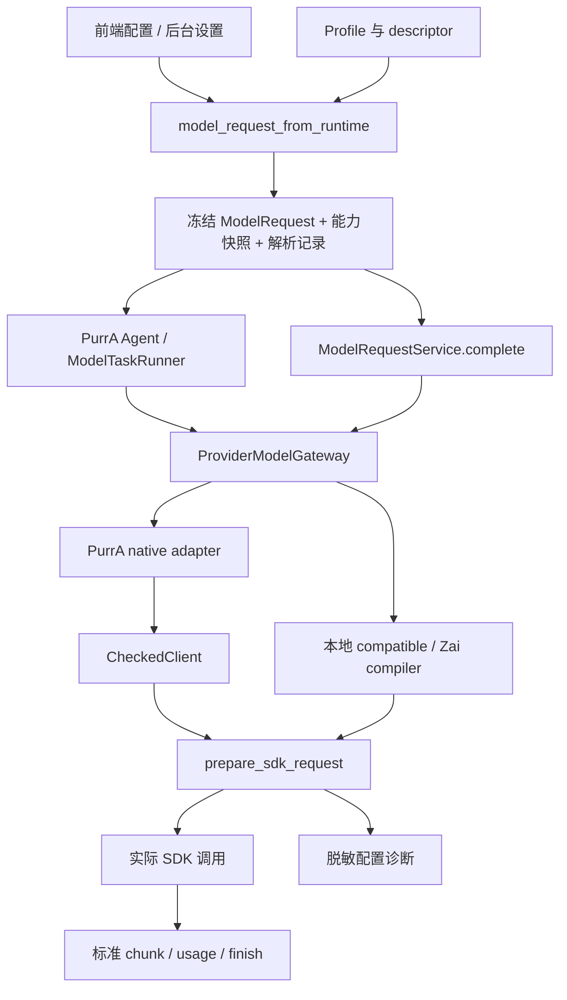

# 模型请求公共入口与适配规范

状态：已实施。适用于 PurrTypos 与已发布的 PurrA 0.5.0。本文规定模型请求的公共边界；后续已恢复三 Agent 与蒸馏验证，实际产物、质量缺陷及框架阻断见[后续验收](2026-09-06-agent-and-distillation-acceptance.md)，不能用请求链路通过代替完整对话或蒸馏质量通过。

## 1. 范围与所有权

小说写作、小说分析、剧本的 Root/子 Run/私有模型任务，以及标题、记忆和后台聊天生成，共用配置解析与 SDK 请求核验边界。领域继续负责材料、工具、审批、业务预算和交付物；公共层不合并三个 Agent 的业务步骤。

| 所有者 | 负责 | 禁止 |
|---|---|---|
| Agent / 业务服务 | 消息、工具、结果要求、任务预算、中立任务偏好 | 识别型号、拼 SDK 参数、直接调用聊天 SDK |
| 公共 resolver | 配置三态、能力校验、确定上限、冻结描述与来源 | 管理 Run 状态、重试、按剩余额度重新决策 |
| ModelProfile / descriptor | 模型能力、取值、默认值、协议规则 | 读取用户设置、管理业务状态 |
| PurrA | Agent 调用编排、预算分配与结算、取消、恢复和输出生命周期 | 产品型号目录、领域语义 |
| 后台任务所有者 | 原有 MemoryBudget/任务状态和结果持久化 | 建立无所有者的裸模型调用 |
| compiler / adapter | 协议转换、实际参数核验、传输、chunk/usage/finish 归一 | 重读当前配置、隐式生成重试 |
| 前端 | 编辑选择、消费同源描述、实时显示公开事件 | 吞掉非法参数、另外计算模型默认能力 |

Embedding、列举模型不是聊天生成协议。它们仍可使用各自专用接口；不通过虚假的聊天调用纳入本入口。本次没有统一 Embedding 执行或迁移凭据存储。

## 2. 实际调用路径

唯一入口指统一的解析和发送契约，不要求所有 Agent 绕过 PurrA 调用同一个 `complete()`。Agent 继续由 Core 驱动 Gateway；后台私有生成经服务执行，避免创建没有业务意义的 Agent Run。

| 文件 | 当前职责 |
|---|---|
| `backend/application/model_runtime.py` | 唯一 `model_request_from_runtime`；`runtime_from_settings` 仅映射产品 DTO；统一上下文解析 |
| `backend/application/model_preferences.py` | SettingChoice、旧设置读迁移、三态合并及来源记录 |
| `backend/application/model_request_service.py` | resolve facade；后台受控 complete，要求 BackgroundModelContext，使用既有预算解析契约 |
| `backend/application/request_mapping.py` | Writing 领域 DTO 映射；调用公共 resolver |
| `backend/infrastructure/models/profiles/` | 模型规则、版本描述、FrozenModelProfile、固定历史 codec |
| `backend/infrastructure/models/provider_model_gateway.py` | PurrA port、调用身份、native/compatible 分派 |
| `backend/infrastructure/models/request_boundary.py` | PreparedProviderRequest、最终参数对账、CheckedClient、单 attempt 发送控制 |
| `backend/infrastructure/models/{openai_chat,anthropic_chat,zai_chat}.py` | 各协议 stream/complete 共用编译；SDK 重试关闭；取消和资源回收 |
| `backend/infrastructure/persistence/model_request_diagnostics.py` | SDK 诊断按 attempt 关联已有调用收据；后台记录任务 owner |
| `backend/application/session_title_service.py` | 标题提示词、清洗，调用公共服务 |
| `src/models/registry.ts`、`descriptors.generated.ts` | 前端展示信息与后端同源描述合并 |

已删除 adapter 的标题生成入口和 `build_model_options`。`model_settings_service` 只保留配置选取/存储职责。`provider_router` 仅为 Gateway 使用的基础设施分派器。记忆和后台分析不再直调它。

## 3. 配置语义

推理模式、推理强度和温度采用明确三态：

| 状态 | 行为 |
|---|---|
| `explicit(value)` | 校验并保留；任务默认不得覆盖 |
| `provider_default` | 不发送这个可选控制；任务默认不得补值 |
| `inherit` | 应用任务偏好或模型默认；记录实际来源 |

Profile 仍可表达强制协议行为，例如始终思考的模型需要固定字段。ProviderDefault 省略的是可选选择，不允许取消强制能力约束。

当前任务偏好仅实现需要的映射，例如小说分析请求 `economical`，GLM Profile 映射为 `low`。它只在 effort 为 Inherit 时生效；旧的缺失值和显式 ProviderDefault 都不能被自动改成 low。非法 effort、思考关闭与 effort 冲突、未知参数、未知 provider、profile/端点不匹配或 descriptor 摘要过期，在 SDK 调用前拒绝。

上下文与生成上限使用已有类型化数值字段：有值表示显式约束，缺失表示继承确定能力上限，不使用 ProviderDefault。内置上下文取 descriptor 默认；自定义模型必须声明必要上下文和生成能力，不能猜成 128k/200k。用户单次上限、模型能力上限、业务结果容量目标与累计 Run/MemoryBudget 是不同值。compiler 使用 invocation 已分配的额度，不重复裁剪。

`modelSettingsVersion=1` 的旧配置读迁移保留原字段。已存数值/布尔选择转成 Explicit，缺失可选控制转成 ProviderDefault，设置中的 `modelPreferenceSources` 分别标注 `legacy_persisted` / `legacy_unspecified`。这不声称还原了用户当初的意图。修改设置时才写回版本化配置；本次没有批量改写正式数据库或历史 Run。

运行期 trace 记录 state、requestedValue、resolvedValue，以及 `configured_choice` / `model_default` / `task_policy` / `task_preference_unmapped` 等来源。`configured_choice` 表示提交的选择，可能来自设置迁移，不等同于断言用户亲自点击过该值。

## 4. 同源描述与冻结

后端 `/ai/model-descriptors` 与 `/settings` 返回版本化描述；前端启动先安装描述再使用配置。离线启动使用 `scripts/generate-model-descriptors.py` 生成的 `src/models/descriptors.generated.ts`，测试验证其与后端一致。新增或修改 Profile 后运行生成脚本，禁止手改生成物。名称、图标、介绍仍由前端维护。

前端提交 `model_descriptor_digest`，后端验证执行语义是否过期。内置 profile 的 model/endpoint 必须匹配；代理使用显式 `profile_binding=compatible`，不将代理当作官方端点。API key 独立绑定，不进入请求摘要、配置 trace 或 SDK 配置日志。

新 ModelRequest 持有冻结 descriptor 和 capability snapshot。SDK 编译消费 FrozenModelProfile，不从当前 registry 重新解析。恢复沿用原 ModelRequest 和既有 Run 身份，不建立第二套恢复标识。

没有 descriptor 的历史请求根据原 capability snapshot 和 `legacy_profile_codecs.py` 的固定历史传输规则执行；未知历史 profile 明确拒绝，不能用今日目录猜测。历史 codec 不随当前目录再生成。仅无持久化快照的底层 adapter 契约测试可使用原始基础设施 options；业务入口必须经过 resolver。

## 5. SDK 参数与取消

compatible/Zai 在本地共享 compiler 后进入 Prepared；native 使用已发布 PurrA adapter 编译，再由公开客户端注入桥接器核验。CheckedClient 覆盖 `with_options`、OpenAI `chat.completions.create`、Anthropic `messages.create` 和返回异步上下文管理器的 `messages.stream`。

每个显式控制必须发送、按冻结协议规则映射或明确拒绝；不得因 SDK 不支持而静默删参。实际生成上限必须与 invocation 一致。kwargs 与诊断来自同一个 Prepared。日志只保存参数核验结果，不保存完整 SDK 消息、工具正文、鉴权或私有思考。消息/工具仍由现有受控输入诊断治理。

未知 provider 不回落 OpenAI。SDK 自动重试为 0；OpenAI compatible 的 include_usage 失败不再自行删字段重发。一次受管 attempt 只能提交一次 SDK 生成请求。重试仍由 PurrA 或既有后台任务所有者决定。

stream 和 complete 都接入取消。取消后不交付迟到结果或写入业务产物。Zai 同步 SDK 使用有限传输超时，并回收迟到的 response/stream；停止等待不代表终止 Python 同步线程。没有供应商侧证据时，不声称远端推理及计费已经停止。

后台 complete 校验实际额度与 finish reason：length 不能被当作完整结果，缺失或异常终态按标准错误返回。公开文案必须使用真实 stream；内部标题/记忆结构化结果可 complete，不将完整结果事后拆字。

## 6. 诊断、输出与清理

`stream.opened.callParameters[0].sdkAttemptId` 与 `ai_model_sdk_requests` 关联。同请求并发执行必须有不同 attempt ID；request digest 不能充当调用身份。

| 记录 | 含义 |
|---|---|
| 调用前请求配置 | Core 建立收据时捕获的请求及解析配置，不表示 SDK 已发送 |
| `sdk_prepared` | SDK 参数已经冻结并通过核验；不表示 Provider 已接受 |
| `provider_response_received` | SDK 返回响应或流响应已打开；不保证生成成功，仍要看 finish/Run 终态 |

诊断面板分别展示调用前配置和 SDK 参数核验。后台请求记录 owner，不伪造 Run。带 Run 的 SDK 诊断随 Run 删除，显式清理计划也列出该表；当前数据库没有全局开启外键，因此同时使用删除 trigger。

沿用现有 canonical journal → SSE → UI，以及公开/私有 output contract。真实 Provider chunk 的即时展示、重放去重、游标、取消和恢复遵循[共享对话规范](shared-agent-conversation-contract.md)。Gateway 不能把 reasoning 或工具参数升级为公开输出。

## 7. 验证门禁

`backend/tests/test_model_request_boundary.py` 覆盖配置三态、迁移、绑定/版本冲突、自定义快照、目录变化后的新旧冻结请求、SDK 漏参、并发 attempt 身份、诊断落库/删除、同步 SDK 迟到资源回收及前后端描述一致性。

架构测试禁止 Application、Domain、Router、Service 绕过 Gateway/公共服务调用聊天适配器。现有协议、预算、工具、恢复、canonical/SSE 和前端 DOM 回归继续执行。测试包含 fake SDK 与 OpenAI mock HTTP body；模拟通过与真实 Provider 通过分别报告。

项目门禁：`npm run check:agent-refactor`、`npm run build:web`、`git diff --check`。Web 打包使用已发布 PurrA 0.5.0；不修改框架源代码。Windows/Electron 安装包未在本次构建。

最终完整检查通过：后端 2,123 项，前端 441 项，类型检查和组件边界检查通过。`npm run build:web` 与 `git diff --check` 均通过。测试与打包不代表真实 Provider/浏览器表现；本轮启动的验证进程均已退出。

## 8. 首轮真实调用证据与限制（后续验收前）

2026-09-06 使用新 Python 进程、临时数据库和合成短输入；正式模型设置只读，测试副本单次生成上限为 2048、effort 为显式 low。没有发送来源文章或写入正式书籍。

| 模型 / 协议 | complete | stream | 首个公开 chunk | 取消验证 |
|---|---|---|---|---|
| GLM-5.3-Flash / Zai | stop，返回“验证通过” | stop，57 个公开 chunk | 0.549 秒 | 首个 chunk 后取消，后续公开 chunk 为 0，约 0.001 秒关闭 |
| DeepSeek-v4-flash / OpenAI compatible | stop，返回“验证通过” | stop，58 个公开 chunk | 0.447 秒 | 首个 chunk 后取消，后续公开 chunk 为 0，约 0.002 秒关闭 |

四次成功请求的 SDK 参数记录均到达 `provider_response_received`，实际 effort=low、生成限额=2048。每项只有一次短样本，以上不是延迟性能提升结论。取消耗时为本地关闭测量，不代表远端计费停止。

OpenAI native、Anthropic native/compatible 没有相应已配置凭据，本轮只有确定性契约覆盖，真实 Provider 验收仍缺失，不能作为这些协议的真实发布验收。没有完成三 Agent 浏览器端到端生成，也没有重启现有 18321 服务；真实调用来自独立新进程，不将旧服务状态算作新代码验收。

下一阶段才恢复同章蒸馏验证，单独处理已知 `novel analysis evidence lost its segment scope`。本次入口统一不证明已修复证据映射或写作 skill 质量。
