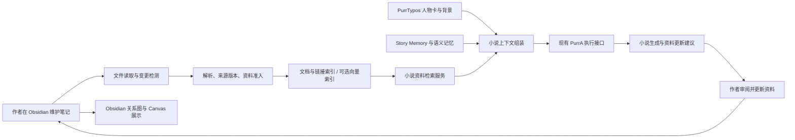

# Obsidian 小说创作资料接入方案

日期：2026-09-06；实施更新：2026-09-07。状态：A–D 首版代码与确定性验证已完成，真实 Provider 对照及 Electron/Obsidian 桌面验收待完成。用户已明确授权代码实现和测试，替代此前仅文档阶段的限制。范围限定 PurrTypos 小说业务、Vault 只读；不修改 PurrA，不涉及剧本，E 阶段留待后续。开发使用临时 Vault 与测试作品，真实 Provider 对照与 Electron/Obsidian 桌面验收尚未完成。

## 1. 目标与范围

让作者在 Obsidian 中维护小说人物、人物关系、世界背景、时间线、伏笔和创作参考，让 PurrTypos 小说 Agent 在需要时取得有来源、有版本、适用于当前写作任务的资料。准确性目标是减少设定违背、时间线错误和角色提前知情，不能预先承诺提升比例。

实施仓库为 PurrTypos，业务入口为 Writing Agent。PurrA 保持通用工具、检索、上下文、证据校验和执行生命周期职责，本方案不新增 PurrA Obsidian 组件，不修改 purra 仓库。剧本、原作分析、多人协作、多设备自动同步不属于本轮范围。已有续写正史约束必须保留，但首个试点选普通原创小说。

首版可视化使用 Obsidian 自带的全局/局部关系图和 Canvas。PurrTypos 提供资料列表、检索、来源预览及“一键在 Obsidian 打开”，不开发或嵌入关系图/画布，不依赖社区插件。按章节查看人物关系、知情范围和时间线的小说专用视图作为后续独立需求；本次也不实施。可视化、来源跳转和 Agent 可读取内容的区别见第 9.1–9.3 节。

推荐分两次交付：

1. **资料读取与检索**：连接一本小说的资料目录，解析、索引、查询、按需提供给 Agent，展示真实来源，完成对照实验。
2. **资料更新建议**：Agent 生成带差异和依据的建议，作者审阅，在 Obsidian 完成现有笔记修改；支持导出独立建议笔记及新建已确认资料。既有笔记的无人值守双向覆盖另行设计。

这两次交付可以形成“维护资料 → 写作使用 → 发现变化 → 审阅更新 → 重新索引”的闭环，不要求先建设完整同步平台。

## 2. 已核对的现状与缺口

以下路径相对仓库根目录，类和方法名是本次源码检查依据，不代表新增能力已实现。

| 当前接点 | 已有能力 | 接入时的工作 |
| --- | --- | --- |
| `backend/application/writing_agent_profile.py` / `WritingAgentProfile` | 装配小说上下文、工具、模型输入证据校验器 | 装配资料服务及组合校验器，只在 writing profile 启用 |
| `backend/application/writing_context_source.py` / `RepositoryWritingContextSource` | 编排关联资料、Story Memory、组件记忆检索 | 增加独立资料源及共同预算；任一可选源失败不能吞掉其他源 |
| `backend/domains/writing/context.py` / `WritingContextProvider` | 规划阶段轻量事实、执行阶段上下文块、来源凭据 | 规划阶段提供目录摘要；执行阶段按任务读取，禁止全库预载 |
| `backend/domains/writing/unified_memory_context.py` | Story Memory 与语义记忆的预算、去重、凭据 | 与外部资料一起处理来源权威和内容预算，不把外部笔记伪装为章节事实 |
| `backend/infrastructure/writing/retrieval.py` | 从持久 Run 验证 writing 身份、book 作用域和检索限额 | 新工具沿用该权限方式，模型不能提交 Vault 路径或选择其他作品 |
| `backend/infrastructure/writing/tools/tool_catalog.py` | 通过公开 `RetrieverTool` 注册检索工具 | 注册小说资料查询；补齐工具 schema、策略、显示名称和技能目录 |
| `backend/application/memory_operations.py` / `memory_delivery.py` | Mem0 记忆操作、来源修订和持久交付 | 保留原语义记忆生命周期；文档索引不触发整库记忆提炼 |
| `backend/application/memory_evidence.py` | 委托 Mem0 证据校验 | 当前 `validate_evidence` 跳过非 `mem0/` 来源，必须补上外部资料校验 |
| `backend/domains/writing/story_memory.py` 与 `backend/application/story_memory_evolution.py` | 章节摘录、修订、变化审阅、正式状态与历史 | 外部资料不直接调用 apply 冒充正文证据 |
| `backend/infrastructure/persistence/writing/sqlite_story_memory_recall_repository.py` | 检索当前 confirmed、active、valid 状态 | `chapter_ids` 是召回/排序条件，不是完整历史截止线；不能宣称已有截至某章的历史投影 |
| `src/Workspace/AiPanel/components/MemoryCenter/index.tsx` | 语义记忆、精确故事状态、AI 候选界面 | 增加外部资料来源浏览/过滤，保留来源间的管理差别 |
| `electron/source_file_ipc.js` | 导入来源文件、目录和压缩包 | 现有目录导入会合并正文，不适合保留 Vault 笔记身份，新增绑定入口 |

当前虚拟环境检测到 `qdrant-client=1.19.0`、`PyYAML=6.0.3`；这是开发环境事实，不是打包依赖已完整声明的证明。实现直接引用时需检查并声明项目依赖，验证分发产物。

## 3. 职责与数据权威

Obsidian 是本地文件资料库；PurrTypos 维护可重建索引、资料准入和使用凭据。原始 Markdown 文件是作者所见资料，索引不是第二套可随意编辑的设定。



### 3.1 资料所有权

| 内容 | 正式维护位置 | 另一侧的行为 |
| --- | --- | --- |
| 新建的外部人物档案、世界背景、参考资料 | Obsidian 笔记 | PurrTypos 浏览、检索、提议更新 |
| 现有 PurrTypos 人物卡、背景、设定实体 | 原业务记录 | 可在接入向导中生成一次性导出预览，未经选择不自动迁移 |
| 已发生的章节事实和人物状态变化 | PurrTypos 正文及 Story Memory 证据链 | Obsidian 可接收带来源的快照；文件修改不自动改变正式故事状态 |
| 一般语义记忆 | 当前记忆组件及其宿主服务 | 可显式选择导出；不默认复制聊天、全部记忆或整个数据库 |
| AI 更新候选 | PurrTypos 待审提议 | 未确认前不进入正式设定检索 |

绑定时识别与现有资料的重叠，以稳定实体标识映射，不能只凭同名自动合并。初始状态维持已有业务记录的所有权；若作者明确选择由 Obsidian 维护某一条资料，则记录所有权转移、冻结对应旧编辑入口并提供来源链接。该对象的旧工具写入必须转为更新提议或返回明确的所有权冲突，不能保留两个活动编辑源。

所有权转移必须同时处理旧资料及派生语义记忆的检索可见性，并把原工具读写者纳入验收。若该部分未完成，该条外部笔记只作为参考，不作为覆盖旧记录的正式设定。所有权调整以单条资料/实体为单位，不在后台自动迁移全书。

### 3.2 不使用全局“谁永远优先”规则

- 作者设定表达计划或约束，正文证据表达已经写出的事实，二者可能同时正确，例如“原定背叛”与“目前仍合作”。
- 对同一事实、同一时间范围的矛盾显示来源差异并要求业务决议；不以修改时间、向量分数或模型置信度自动覆盖。
- 用户明确要求改设定可形成修改提议，但不能仅靠一次普通对话永久替换历史事实。
- 续写场景现有继承正史边界保持有效；外部笔记不能覆盖冻结的原作事实。

## 4. Vault 绑定与资料规范

### 4.1 绑定方式

首版支持本机一个作品绑定一个 Vault 内的独立目录。多个作品可以使用同一 Vault 的不重叠目录；不扫描整个个人 Vault。移动目录后由作者重新绑定，不通过全盘搜索寻找相似文件。

桌面端由 Electron 文件夹选择器获得目录，经宿主校验后保存绑定；前端使用绑定 ID。浏览器不具备任意读取本地文件夹的权限：首版持续绑定以 Electron 为目标，本地 Web 可提供一次性导入快照；远程部署不接受用户电脑路径冒充服务端可读目录。

绑定保存 `bindingId`、`bookId`、本机规范化根路径、选定相对目录、读取模式、连接代次 `generation`、最后成功扫描时间。解除绑定立即禁止新查询和恢复 Run 使用该来源，关闭监听；保留原文件，清理派生索引可异步进行。重新绑定不能复活旧代次凭据。

建议目录，不强制重排既有笔记：

```text
我的小说/
  人物/
  人物关系/
  世界背景/
  地点与组织/
  时间线/
  剧情与伏笔/
  灵感与参考/
  更新建议/
```

### 4.2 文件与身份

- 首版读取 UTF-8 Markdown、YAML 属性、Wikilink、普通 Markdown 内链以及标题/块定位。图片、PDF、Canvas、插件脚本和远程网页暂不提取。
- `.canvas` 文件的文字卡片、连线标签、分组与布局不进入索引、Embedding 或模型上下文。画布引用的 Markdown 笔记只有在已绑定目录内、通过通常准入规则时才独立读取；“画布可见”不等于“Agent 已读取”。
- 一个类型明确的资料条目对应一篇笔记；复杂关系变化拆成多篇有适用范围的条目，避免一整页同时包含互相矛盾的历史状态。
- 推荐由创建向导生成 `purr_id`。既有无 ID 笔记先用数据库侧稳定映射读取，不为索引自动修改原文件；移动无 ID 文件只在能明确对应时延续身份，否则作为新增/缺失等待映射。重复 ID 隔离为冲突，不合并。
- 内容 hash 表示文件修订；分块 ID 由资料 ID、修订和定位生成。标题和路径用于显示/定位，不充当永久实体 ID。
- 链接只表示引用，不能把 `[[乙]]` 自动解释成朋友、敌人或配偶。关系类型、方向、适用范围需要显式资料。
- 不递归展开嵌入；同名链接歧义、断链、循环链接有诊断。外链不自动抓取，链接不能越过绑定目录读取另一作品。

关系条目示例；字段由模板生成，不要求作者手写内部 ID：

```yaml
---
purr_id: relation-jia-yi-betrayal
type: relationship
status: confirmed
entity_refs:
  - "[[人物/甲]]"
  - "[[人物/乙]]"
relation: distrusts
subject: "[[人物/甲]]"
object: "[[人物/乙]]"
temporal_scope: chapter_range
valid_from_chapter: chapter-008
known_to:
  - "[[人物/甲]]"
knowledge_from_chapter: chapter-008
---
```

正文记录关系内容、变化原因及依据。`chapter-008` 在此为演示稳定章节 ID，真实绑定须来自当前作品；数字序号不作为永久身份。

推荐人物关系的正文写法：`[[人物/甲]] 在第八章发现 [[人物/乙]] 的背叛，从此不再信任乙；乙尚不知道甲已发现。` 同时保留上例的结构化字段。这样作者能够沿笔记内链查看相关资料，Agent 能读取实际关系及范围；关系图上的连线仍只代表引用。正文与属性矛盾时显示待处理差异，不让模型自行选择一方。

### 4.3 状态与来源准入

笔记声明状态采用 `draft / confirmed / deprecated`；索引另有 `reference / eligible / conflict / stale / missing` 等宿主状态，两者不能混用。作者在已授权的资料目录明确声明 confirmed 可以作为作者确认；AI 不能通过写 `confirmed` 获得同等权威，AI 建议目录始终按候选处理。

缺少状态、章节范围或实体映射时允许作者浏览和参考检索，但不自动当作正式约束。已确认资料被外部修改后重新校验；文件解析失败或适用范围失效时，旧版本不得继续伪装成当前有效。

## 5. 小说时间与知情范围

检索请求增加宿主控制的写作视角：`currentChapterId`、章节顺序修订、`purpose`（设定讨论/正文续写/人物视角）、可选视角人物。模型可以提出检索目标，但不能扩大宿主限定范围。

- **故事有效期**：`global` 只用于明确确认的稳定设定；变化事实使用起止章节。首版范围为起章包含、止章不包含；缺起点的变化事实不是全局事实。
- **角色知情范围**：作者知道不等于人物知道。`known_to` 表示谁已知；不同人物在不同章节知情时拆成独立知识条目。未知知情范围不能作为人物已经知道的依据。
- **未来计划**：设定讨论可按用户任务检索未来计划；正文续写默认排除未来事实。作者层计划与角色层已知事实使用不同上下文标签。
- **章节变化**：正文修订、章节删除和重排都要重新验证资料范围与来源引用；以作品当前章节顺序解析稳定 ID。

现有 Story Memory 只有 `search_current`，不能用“挑选某来源章节”冒充完整历史状态。首版启用 Obsidian 的试点作品必须对其他进入模型的资料同样进行时间准入：能验证适用范围的提供给模型，不能验证的标记缺失，不混入所谓历史快照。涉及早期章节重写时，如需要恢复旧状态，则补充基于有效版本/章节证据的历史投影并单独验收；未完成前明确不提供完整历史回放能力。

该约束是业务侧检索和来源使用政策，不更改共享 Planner 生命周期，也不强制每次小说任务执行固定的检索步骤。

## 6. 索引与检索实现

### 6.1 可重建文档索引

SQLite 存储绑定、笔记清单、不可变修订、分块、链接、实体映射、准入与冲突信息；全文索引使用 FTS5。中文检索须增加经过测试的中文分词或字符级候选通道，不能假定默认 tokenizer 已有足够召回率。人名/别名走精确映射，减少专有名词漏召回。

语义检索推荐使用 Qdrant 本地模式作为文档向量缓存，使用独立数据目录和 collection，由 PurrTypos lifespan 持有单个客户端。不得打开 Mem0 的私有存储目录或借用其内部 collection。当前文档向量只是原文的派生索引，不新增通用记忆 CRUD、推断或遗忘系统。初版限单机单后端进程，规模性能需要实测。[Qdrant 官方客户端说明](https://github.com/qdrant/qdrant-client)

Embedding 复用现有宿主配置解析与 `OpenAIEmbeddingGateway` 适配方式，但调用次数、Token、取消、限额和资源关闭需由资料索引服务显式管理，不能假定绕开 Mem0 后仍自动获得其预算。未配置时精确/全文检索可用，界面明确“语义检索未启用”。

索引和向量默认在本地；如使用远程 Embedding，待索引文本会发送给所配置服务。启用界面明确显示 Provider、资料范围和发送用途；不称为全程离线。首版不自动下载本地模型，也不自动替用户选择收费服务。

### 6.2 更新与一致性

1. 首次连接预览可读取文件、忽略文件、资料状态和重叠对象，确认目录范围后建立索引。
2. 原生文件事件合并后做稳定读取；启动和手动刷新进行清单校验，补偿丢失事件。文件连续变化时标记处理中，不接受半写入内容。
3. 每篇笔记按标题、段落和完整事实分块；保留标题路径、原文定位和上下文。切块器版本参与缓存键。
4. 文本修订、分块与索引任务在 SQLite 中持久记录；向量任务可恢复并幂等执行，键包含绑定代次、资料 ID、修订、切块器版本和 Embedding 配置版本。
5. 新向量尚未准备好时，当前文本可走全文检索；旧向量即使命中也必须通过 SQLite 当前修订与绑定状态校验后才能返回，不能从向量 payload 直接输出旧正文。
6. 修改、删除、解除绑定先使旧修订不可使用，再异步移除旧向量。仅在一次完整成功扫描确认文件不存在时记为 missing；目录不可访问是 unavailable，不批量误判删除。
7. 检索结果记录使用的索引代次；发送模型前再次验证涉及文件的内容 hash 与准入状态。变化时重新读取/拒绝过期证据，不能记录“最新”却发送旧片段。
8. 已经发送给 Provider 的资料属于该次调用的历史事实；之后发生修改只能影响后续调用，不能撤回已发送输入。持久记录使用的修订以便诊断。

本地根路径只供适配器使用。拒绝符号链接逃逸、目录穿越和超限读取；隐藏配置目录、`.obsidian`、`.git`、回收站及未授权子目录不进入索引。外部文本作为资料输入，不能获得工具授权或覆盖系统/共享 Agent 规则。

### 6.3 检索流程与建议初值

顺序为：作用域/状态/时间准入 → 实体与别名精确召回、全文召回、可选向量召回 → 排名融合 → 必要时一跳链接补充 → 来源冲突检查 → 完整条目预算选择 → 版本复验 → 上下文及凭据。

以下是可调整工程初值，不是准确性结论：单篇解析上限 1 MiB、单作品 2,000 篇 Markdown、分块目标 300–600 估算 Token、单次合并候选最多 40 个、返回正文片段最多 12 个。单源结果不足不能从其他作品补齐。Embedding 模型有更小输入限制时服从模型限制，超限显示原因而不是静默截断整个资料库。

Obsidian 使用现有小说检索总预算中的一部分，起始上限为可用检索预算的 40%，空闲预算可回收；实现前根据真实上下文占比调整。当前任务、直接编辑正文和必要硬约束先分配，不能以添加资料为由扩张总上下文。超预算的条目记录 deferred，不裁断关系谓词或时间范围后当作完整事实提供。

默认使用确定性排名融合，不再追加一次必需的 LLM 重排。后续重排只有在真实对照实验中改善结果且成本可接受时启用。

## 7. Agent 接口与真实使用证据

建议新增业务工具名；均尚未实现：

| 工具 | 输入与输出 | 权限边界 |
| --- | --- | --- |
| `searchNovelKnowledge` | 查询、受限资料类型；返回标题、摘要/片段、定位、版本、状态、适用范围和凭据 | 从 Run 确定作品和绑定，复用公开 Retrieval 接口 |
| `readNovelKnowledge` | 稳定资料 ID、可选标题/块定位、期望修订；返回受预算约束的原文 | 每次复验绑定、文件版本及适用范围，不接受任意路径 |
| `proposeNovelKnowledgeUpdate` | 目标资料、建议差异、原因和证据；返回持久待审建议 | 只创建提议，不能自动改原文或自行确认 |

模型不必每次使用全部工具。自动上下文与主动工具调用共享检索服务、准入规则和预算，不维护两套搜索逻辑。新增工具按现有 writing 工具契约登记；不恢复已经删除的 prepared-read 机制。

资料文本通过小说 ContextProvider 或工具结果进入模型，前端和路由只传任务选择及来源标识。增加独立的 `writing_knowledge` 上下文块及凭据，不把它强塞入只表示 Mem0 使用情况的统计字段。

凭据至少包含 `evidenceId`、来源类型、绑定 ID/代次、资料 ID、修订 hash、分块定位、适用章节快照。路径由 UI 在宿主侧解析为可打开链接，模型不需要用户绝对路径。组合 `BookMemoryEvidenceValidator` 与新资料校验器；旧 Validator 会跳过非 Mem0 来源，所以“已经接上 validator”不等于外部资料受保护。

首次生成、工具结果复用、历史重放、断线恢复后再次调用 Provider 都需证明经过版本校验。新增证据命名空间的 dispatch 必须明确；本来源缺少校验器时不得默默放行。使用现有公共校验接点，发现不足先提出明确接口缺口，不导入 PurrA 私有 engine。

界面区分“已索引”“已召回”“实际提供给模型”；最终 Provider 输入凭据才用于使用统计。AiDevInspector 展示资料名、章节范围、修订、召回原因和被排除原因；正文默认折叠，字符数与真实输入/输出 Token 分开。不得用文件数、向量数或模型自述证明 Agent 已使用资料。

## 8. 资料更新与文件写入

第一阶段保持文件只读；作者在 Obsidian 编辑，PurrTypos 检测并更新索引。

第二阶段流程：

1. Agent 生成待审提议：目标资料、基础修订、建议差异、证据来源、发起 Run；持久状态为 pending。
2. 作者可拒绝、编辑建议、导出建议笔记或确认创建新资料；这些是明确的产品命令。已接受章节的故事状态仍走现有 Story Memory 审阅路径。
3. 现有笔记的修改由作者在 Obsidian 完成；重新扫描后比对实际文件，只有真实变化才能标记已落实。仅点击“接受建议”不能谎报文件已修改。
4. 导出到单独的“更新建议”目录，新建文件使用排他创建、内容校验和持久操作 ID。存在同名文件时不覆盖；重试相同操作返回同一结果。
5. 新建正式资料由宿主在作者确认后生成状态及身份字段；建议目录中的 AI 文件始终不自动升级为 confirmed。

不将“写前比较 hash，再原子 rename”描述为跨 Obsidian 的并发安全更新：外部编辑器不遵守我们的锁，检查与写入之间仍有竞态。若后续要求自动修改既有文件，应另做协调编辑/插件协议或明确的独占编辑工作流及故障恢复验收。SQLite 事务也不能回滚已落盘的文件，因此文件操作须有 pending/applied/conflict/failed 记录和崩溃后核对流程，不能套用现有数据库原子工具包装后宣称跨存储原子提交。

## 9. 产品入口与拟新增模块

作品内新增“创作资料库”入口：连接目录、同步状态、范围预览、资料列表、搜索、来源冲突、在 Obsidian 打开、解除绑定。Memory Center 增加外部资料来源筛选/跳转，沿用现有组件与样式。第一次进入不要求了解向量、分块或内部 ID；语义检索配置放在可展开的设置中。

### 9.1 可视化分工

| 使用场景 | 首版入口与行为 | 能力边界 |
| --- | --- | --- |
| 查看整部小说的资料关联 | 在 Obsidian 打开全局关系图，按小说目录筛选 | 节点是笔记，边是内链；不是自动推导的小说事实图 |
| 查看某个人物关联的资料 | 从 PurrTypos 打开该人物笔记，再在 Obsidian 使用局部关系图 | 不承诺 URI 能自动切换到局部图或设置过滤条件 |
| 自由摆放人物、事件和参考资料 | 在 Obsidian Canvas 中引用笔记、手动布局和连线 | PurrTypos 不解析画布内容、不自动维护布局或连线 |
| 搜索资料及核对来源 | PurrTypos 资料列表、搜索结果、片段预览 | 显示笔记标题、状态、适用范围、来源修订；不是新建图谱页面 |
| 查看 Agent 本次实际使用的资料 | PurrTypos 来源记录和诊断入口 | 来源凭据记录实际输入；画布、图谱或预览被打开都不算模型使用 |
| 截至某章节的人物关系、角色知情和事件时间线 | 后续独立开发小说专用视图 | 不属于本方案首版或资料更新建议阶段，不以原生关系图代替 |

Obsidian 的关系图依据笔记内链展示全局或局部关联；Canvas 可以人工排列卡片并给连线添加标签。[官方关系图说明](https://obsidian.md/help/plugins/graph)、[官方 Canvas 说明](https://obsidian.md/help/plugins/canvas)

同一 Vault 存放其他作品时，全局图可能显示其他目录。作者可在 Obsidian 按目录过滤，这只影响可视化；Agent 的访问范围始终由 PurrTypos 的绑定决定，不能从用户打开的图谱或 Canvas 扩大。

### 9.2 Canvas 与正式资料的使用规则

正式人物设定、关系变化、背景规则和事件事实应保存在 Markdown 笔记中，Canvas 引用这些笔记用于组织和展示。关系本身可以是一篇独立笔记，记录主客体、关系类型、适用章节和证据；首版不承诺这些字段自动变成画布边上的标签。

如果作者在 Canvas 新建纯文字卡片记录重要设定，应先将卡片转为 Markdown 笔记或把内容整理到既有资料笔记，放进绑定范围并明确状态，之后才能由索引服务摄取。仅修改连线标签、移动卡片或改变颜色，不视为人物关系、时间或事实发生了变化。[Canvas 的文字卡片与转为文件说明](https://obsidian.md/help/plugins/canvas)

连接预览及索引状态必须分别列出已摄取的 Markdown 和未支持的文件类型；可统计跳过的 `.canvas` 文件，但不分析其中的卡片数量或内容。产品提示使用“画布内容暂不参与 AI 检索，请将需要使用的设定保存为笔记”等明确说明，不能显示“整个知识库已同步”掩盖未摄取内容。

作者日常流程为：在 Obsidian 整理笔记/可视化 → PurrTypos 检测笔记修订 → 写作时按需读取 → 在 PurrTypos 查看来源 → 打开 Obsidian 原笔记核对或编辑。Obsidian 关闭时，只要文件可访问，PurrTypos 仍可读取和检索；要查看其关系图和 Canvas 时再打开应用。

### 9.3 来源跳转协议与失败处理

“在 Obsidian 打开”是作者点击的本机导航操作，不是模型工具，不创建或修改笔记。首版通过官方 Obsidian URI 的 `open` 动作实现，由宿主按已验证来源生成地址，不执行笔记或模型提供的任意 URI。[官方 URI 说明](https://obsidian.md/help/Extending%2BObsidian/Obsidian%2BURI)

1. 前端提交 `documentId` 和可选证据定位；宿主重新验证作品、绑定代次和当前文件位置。绝对路径只用于本机导航，不送给模型或存入公开进度文本。
2. 普通跳转使用经过 URL 编码的当前文件路径；标题/块定位使用官方支持的 Vault 与文件定位方式并编码 `#` 等字符，中文、空格和特殊字符必须测试。无法可靠定位标题或块时回退到原笔记并显示定位信息，不跳到其他同名文件。
3. Vault 必须已由作者在 Obsidian 中打开注册；绑定一个普通目录不等于 Obsidian 已识别它。未安装、协议未注册或 Vault 未识别时，保留 PurrTypos 中的来源预览，提供复制路径/在文件管理器定位及手动打开说明，不自动安装应用或插件。
4. 发起外部 URI 成功只证明已交给操作系统，不能据此报告“Obsidian 已打开指定页面”。返回明确的 dispatch/failed 状态；实际页面定位通过桌面验收检查。
5. 来源修订与 Agent 使用版本不同，预览分别显示“本次使用版本”和“当前文件已更新”；跳转打开的是当前原文件，不能让作者误以为它就是当时模型看到的文本。文件已删除、移出范围或绑定解除时停止原文件跳转，保留有权限访问的历史来源记录。
6. 本地 Web 或远程浏览器不承诺拥有与 Electron 相同的本机定位能力；仅在本机来源及协议可用时提供外部跳转，否则保留来源预览与可复制定位信息。

### 9.4 持久数据与模块

当前数据分三处：原始 Vault 文件、PurrTypos SQLite 的绑定/修订/建议记录、可重建向量缓存。备份说明必须明确 SQLite 备份不包含外部原文；删除作品或解除绑定不删除 Vault。恢复数据库后要求重新验证本机绑定再允许 Agent 使用。

拟新增持久表：`novel_knowledge_bindings`、`novel_knowledge_documents`、`novel_knowledge_revisions`、`novel_knowledge_chunks`、`novel_knowledge_links`、`novel_knowledge_entity_bindings`、`novel_knowledge_index_jobs`、`novel_knowledge_proposals`。字段和迁移在实现时细化；索引可重建，绑定权限、来源历史和用户决议不能作为缓存丢弃。原文修订只保存实际摄取内容，不伪造接入前历史。

| 拟新增位置 | 职责 |
| --- | --- |
| `backend/domains/writing/knowledge/` | 资料、作用域、时间准入、状态和检索结果合同 |
| `backend/application/novel_knowledge_service.py` | 连接、索引编排、资料查询与所有权 |
| `backend/application/novel_knowledge_proposals.py` | 建议与用户决议 |
| `backend/application/novel_knowledge_evidence.py` | 来源版本校验和已有校验器组合 |
| `backend/infrastructure/obsidian/` | 安全文件读取、Markdown/YAML/链接解析、变更检测、新文件导出 |
| `backend/infrastructure/persistence/writing/sqlite_novel_knowledge_repository.py` | 资料来源、修订和全文索引 |
| `backend/infrastructure/writing/knowledge_vector_index.py` | Qdrant 文档索引与资源生命周期 |
| `backend/routers/novel_knowledge.py` / `backend/schemas/novel_knowledge.py` | 强类型管理 API，绑定和提议版本校验 |
| `electron/novel_knowledge_ipc.js` 与 preload/前端类型 | 选择目录、绑定授权、校验并派发 Obsidian 来源 URI、跳转失败反馈 |
| `src/Workspace/KnowledgePanel/` / `src/services/novelKnowledge.ts` | 作品级资料管理、检索/来源预览、Obsidian 跳转及未摄取内容说明 |

复用/修改的现有接点见第 2 节；工具接入还需修改 `WritingToolDependencies`、writing 工具 catalog/schema/policy/display names 及 `backend/skills` 对应文件。资源启动和关闭接入现有宿主 lifespan。实现前重新查看工作区 diff，当前仓库存在大量其他未提交修改，不覆盖或捎带清理。

建议管理 API 前缀 `/books/{bookId}/knowledge`，提供 binding、index/status、documents、search、proposals 资源。绑定创建只接受宿主选择授权令牌；模型工具不直接访问这些管理接口。更新需期望版本和稳定命令 ID，重复提交与版本冲突分别返回。不存在、不可用、无匹配、待索引、冲突不能全部返回空列表。

## 10. 实施顺序与退出条件

| 阶段 | 交付 | 退出条件 |
| --- | --- | --- |
| A：资料规范与试点基线 | 一本小说的临时 Vault、实体映射、已确认/候选/历史/未来案例及 Canvas 示例，冻结当前 Agent 结果 | 所有权和范围规则可解释；覆盖中文同名、别名、矛盾、知情范围，以及仅在画布出现的内容 |
| B：连接与本地读取 | 绑定、清单、解析、版本、链接、全文检索、刷新和解绑 | 重启后可读；修改/删除立即失效；扫描失败不误删；跨书和路径越界被拒绝；Canvas 跳过状态准确 |
| C：Agent 集成 | 查询/读取工具、上下文预算、凭据、组合校验、来源预览与 Obsidian 跳转 | 新 Run 的真实模型输入包含正确资料；待定/未来/过期及仅在 Canvas 中的内容未越界；来源跳转桌面验收通过；关闭功能时原流程仍可用 |
| D：语义检索与效果评估 | 增量 Embedding、Qdrant、融合检索、成本统计 | 相同任务下比较全文与混合检索；故障可降级且不返回旧资料；形成真实实验报告 |
| E：建议闭环 | 待审差异、依据、拒绝、新文件导出与新建资料 | 未确认建议不变正式事实；重复导出不重复创建；文件存在不覆盖；实际改动可核对 |

A–D 是首个可用版本，E 是第二次交付。所有权转移只有完整打通旧卡片读写者、派生记忆和新来源时才开放；不能用 UI 提示代替后端边界。

不在需求尚未实现前给出工期承诺。预计主要成本集中在来源所有权、时间准入、恢复时证据校验与冲突处理；Markdown 读取通常不是难点。多机同步、自动覆盖和全书历史重建会显著扩大范围。

## 11. 验收与对照实验

### 11.1 确定性检查

- 解析：中文人名、别名、重复 ID/标题、Wikilink、普通内链、标题/块定位、坏 YAML、断链、循环嵌入、超限文件。
- 可视化边界：只有 Canvas 文字卡片或连线标签存在的事实不得进入索引/模型；同样内容转为范围内合格 Markdown 后可检索；仅移动或着色卡片不触发语义事实更新；画布指向范围外笔记不能扩大访问权限。
- 来源跳转：中文、空格、特殊字符、同名文件、标题/块定位、重命名、删除、解绑、过期证据和任意 URI 注入；仅允许宿主生成的打开动作，不带创建/追加/覆盖参数。
- 隔离：跨作品同名资料、伪造绑定/路径、符号链接逃逸、解除绑定后的旧 Run、数据库恢复后的旧路径均不能取得未授权资料。
- 正确性：待定灵感不当正式事实、不同方向关系不合并、未知知情范围不默认已知、后续章节状态不进入早期写作；缺失历史状态明确报告。
- 一致性：修改时重建、删除但向量清理未完成、文件事件丢失、无法访问根目录、Embedding 超时/取消、模型配置变更重建、重启恢复、同一索引任务重放。
- 证据：实际输入与凭据一一对应，预算裁剪撤销未提供条目的使用声明；工具复用/恢复期间旧修订必须失效。
- 写入：提议拒绝、基础修订变化、排他新建、重复命令、文件成功但 DB 状态未更新时的恢复；不测试或承诺首版不具备的自动覆盖。

### 11.2 桌面可视化与来源跳转验收

在临时 Vault 与 Electron 中验证，不把 URI 单元测试当成应用实际定位通过：

1. 点击 PurrTypos 中的资料来源，Obsidian 打开正确笔记；从该笔记手动打开局部关系图能够查看已存在的内链。全局图、Canvas 由 Obsidian 自己提供，不出现伪造为 PurrTypos 功能的图谱入口。
2. Canvas 引用已绑定的 Markdown 笔记时，Agent 读取的证据仍指向 Markdown；纯画布文字、连线标签没有使用凭据，且界面准确解释未读取范围。
3. 修改原笔记后，索引及模型输入更新到新修订；历史使用预览继续对应旧修订，并说明打开原文件将看到当前版本。
4. 关闭 Obsidian 后资料检索仍可用；未安装/未注册协议、Vault 不可识别及原文件缺失分别验证合理反馈，不将外部导航失败显示为索引数据丢失。
5. 任一打开动作不修改 Vault 内容或画布布局，不安装社区插件；运行测试启动的应用/服务按项目规则关闭。

### 11.3 真实 Provider 对照

先固定一本小说的资料、模型/采样设置、任务和总上下文预算，保存隔离基线；不要因不同组读取不同版本的资料而误判提升。建议先建立 30 个案例，每组每例运行 3 次，这是初始实验规模，不保证统计显著性。

| 组别 | 目的 |
| --- | --- |
| 当前流程，无 Obsidian | 衡量实际新增资料和接入流程的总体收益 |
| 相同资料，精确＋全文检索 | 衡量引入资料及结构过滤的收益 |
| 相同资料，精确＋全文＋向量检索 | 在资料一致时单独衡量向量检索增益 |

如当前流程能承载同一批资料，再加等资料基线，避免把“增加了资料”误说成“Obsidian 更准确”。评估资料与调参资料分开，不用测试答案调检索阈值。

记录：应检索事实命中率、无关资料比例、设定违背、时间线错误、角色提前知情、来源正确率、未知问题的正确保留；另记录检索耗时、首次模型活动、模型时间、首次公开进展、端到端耗时和输入/输出/Embedding Token。文学质量由隐藏组别的人工比较单列，不与事实正确率混为一个分数。

准入硬门槛：确定性隔离、版本、状态和文件不覆盖测试全部通过；受控案例中不能出现跨书数据或已失效证据进入模型。准确性提升需报告原始错误数量、比例和多次运行波动；没有稳定改善就继续保留全文方式，不宣称 RAG 已改善准确性。真实生成无法保证零错误。

实现后的相关测试入口优先覆盖 `test_writing_retrieval.py`、`test_writing_context.py`、`test_unified_memory_context.py`、`test_memory_operations.py` 及新增资料测试；完成适用的 typecheck、前端单元、组件约束、后端回归和 Web 构建。后端整套使用 `.venv/bin/python -m pytest backend/tests -q`。Python/依赖变化后重启后端，再建立可比较的新 Run；离线通过不等于 Provider 或 Electron 全链路通过。

实施阶段执行应用测试与临时数据验证；确定性、模拟 Provider、真实 Provider 与 Electron 验收分别记录，未执行的退出条件保持待验。

## 12. 官方资料与技术前提

- Obsidian 的 Vault 是本地 Markdown 文件目录，外部程序可以编辑文件；本方案采用文件适配，不依赖 Obsidian 进程持续运行。[官方存储说明](https://obsidian.md/help/Files%2Band%2Bfolders/How%2BObsidian%2Bstores%2Bdata)
- 属性适合简单结构化信息，复杂嵌套对象不适合直接作为原生属性编辑体验；模板使用平铺字段和列表。[官方属性说明](https://obsidian.md/help/properties)
- 内链包括 Wikilink、Markdown 链接、标题和块引用；块引用不是标准 Markdown，适配器要显式支持。[官方链接说明](https://obsidian.md/help/links)
- Obsidian 原生 Search 是词语/运算符/属性检索；本方案的融合检索、小说准入和 Agent 接入由 PurrTypos 实现。[官方搜索说明](https://obsidian.md/help/plugins/search)
- 首版直接使用 Obsidian 的关系图和 Canvas 进行可视化；图谱边代表笔记引用，画布布局及标签由作者维护。[官方关系图说明](https://obsidian.md/help/plugins/graph)、[官方 Canvas 说明](https://obsidian.md/help/plugins/canvas)
- 官方 URI 支持跨应用打开笔记以及标题/块定位；本方案仅用打开能力，并单独验证操作系统派发和实际应用定位。[官方 URI 说明](https://obsidian.md/help/Extending%2BObsidian/Obsidian%2BURI)

本方案未选择或安装 Obsidian 社区插件，未替作者建立真实资料目录；实施时还需用户选定试点作品及 Vault 位置。


## 13. 实施记录（2026-09-07）

开始时工作区干净。直接在当前工作区实现，未创建独立工作树；未改动 PurrA 仓库或真实 Vault。

已核对并修正的实施选择：

- 当前小说章节在 `outline_chapters`，通过 `outlines.type=writing` 与作品关联；章节顺序按目录树展开。资料范围保存稳定章节 ID，并记录章节顺序与正文修订摘要。
- 首版不开放所有权转移。外部 `purr_id` 保留 Obsidian 所有权；`purr_entity: character:<id>` 或 `setting:<id>` 声明与原实体重叠，同名未映射也进入参考状态。原卡片和派生记忆不被覆盖。
- 原记忆和设定缺少历史/知情投影：正文/人物模式下暂不注入这些来源，旧工具也受到持久 Run 的范围限制；作者显式选择设定讨论模式时可读取当前状态。未实现完整历史回放。
- 首版采用 5 秒清单轮询、查询前完整扫描、发送前来源 hash 复验，保证文件事件丢失不影响正确性；尚未使用原生文件事件来优化大型目录扫描成本。单目录上限 2,000 篇、单篇 1 MiB，总扫描 64 MiB。
- Obsidian 跳转使用宿主生成的 `open?path=`，特殊字符完整编码；标题/块首版明确回退到原文件并显示定位信息，避免 Vault 同名引起误跳。URI 派发不等于应用实际定位通过。
- 语义功能复用已有 Embedding 配置，但需单独明确授权；使用独立 Qdrant 目录及 collection。首版由作者点击分批索引，每批最多 40 个片段，不自动在后台发起收费请求。配置身份变化需重新授权，失败降级全文，旧向量不能绕过 SQLite 当前修订校验。
- 工具与自动上下文共用一个资料服务；自动上下文占现有检索预算最多 40%，工具读取有单次 3,000 估算 Token 上限。完整片段放不下时暂缓，不裁成残缺事实。
- `stream.opened.contextEvidence` 是实际调用输入凭据来源；管理页召回不计入模型使用。来源预览保存当次修订，数据库恢复后绑定需重新授权，SQLite 备份不包括 Vault 文件。

阶段状态与证据：

| 项目 | 结果 | 证据与边界 |
| --- | --- | --- |
| A：试点资料 | 已完成隔离样本与规范案例 | `scripts/create-novel-knowledge-fixture.py` 仅生成新临时目录；未选用或迁移真实作品。真实 Provider 基线待采集 |
| B：资料连接 | 代码及确定性测试通过 | `backend/tests/test_novel_knowledge.py` 覆盖只读、路径/作品隔离、状态、范围、修订、重启和恢复授权 |
| C：Agent 与来源 | 代码及模拟 Provider 集成通过 | 实际应用组合/聊天接口/持久 Run 的模型请求和 `stream.opened.contextEvidence` 已断言；真实 Provider 与桌面外部跳转待验 |
| D：语义检索 | 代码与本地 Qdrant 测试通过 | 确定性 Embedding 网关验证增量、配置变化、缓存丢失、失败降级；真实服务与效果对照待验 |
| E：资料写入 | 未实施 | 保持本轮只读边界 |

最终验证（2026-09-07）：

- 后端全量：`.venv/bin/python -m pytest backend/tests -q -o addopts='' --tb=short`，**2,187 passed**，139.67 秒。新增资料测试 25 项包含参数化案例；本轮相关定向回归 **88 passed**。`-o addopts=''` 仅清除额外 pytest 参数，不排除用例。
- 前端：`npm run typecheck`、`npm run check:purr-components` 通过；`npm run test:unit` **460 passed**，含 3 项新增 Electron IPC 测试。
- 构建：`npm run build:web` 通过，生成 `dist-web`；检查打包资源的核心新增/修改源码与当前源码一致，含 `qdrant-client 1.19.0`、`PyYAML 6.0.3`、已发布 `purra 0.5.0`。未构建或验收 Electron 安装包。
- 工作区：`git diff --check` 通过；PurrA 仓库无改动。首次全量暴露的上下文空值序列化、旧工具集合断言已修正后重新跑完整套。
- 临时 HTTP 服务已启动验证并关闭；`18331` 和 `5175` 无监听。浏览器对临时 API 返回 `net::ERR_BLOCKED_BY_CLIENT`，该尝试不计为 UI 验收；未绕过浏览器访问限制。
- 未调用真实生成/Embedding Provider，未执行 Electron 对话框与 Obsidian 实际跳转验收，没有准确性提升结论。

实施过程还修正了自动上下文与工具重复读取同一片段时的凭据 ID 冲突；范围撤销在没有资料凭据时也会拦截旧 Run 的下一次模型调用；全文召回先按准入后的片段 ID 过滤，再限制候选数量，避免大量草稿挤占有效结果。

详细试用步骤、资料模板和未验证边界见 [验证与试用记录](../validation/2026-09-07-obsidian-novel-knowledge.md)。真实 Provider、Electron 桌面和效果实验退出条件仍保持待验，不能把本表确定性通过视为这些条件通过。
