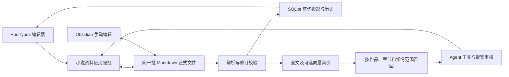

# 小说创作资料共享 Markdown 存储

日期：2026-09-07。

状态：已完成首版共享文件存储、显式迁移、编辑器与 Agent 提案接入。范围确定为人物卡、故事背景、设定资料；正文与手动长期记忆不迁移。确定性回归及临时 Vault 的 Obsidian 双向编辑验证已完成，Electron 内完整点击流程和真实 Provider 验证待验收。真实创作资料未迁移。详细证据见 [验证记录](../validation/2026-09-07-shared-markdown-creation-materials.md)。

2026-09-09：人物、背景、设定写入已接入默认 Obsidian 引用解析；小说 Agent 修改关系时使用资料读取结果提供的 `materialLink`。同名不猜选、不跨作品解析、不修改正文或只读继承基线；现有资料未批量改写。实现范围和验证边界见 [默认资料链接验证](../validation/2026-09-09-default-material-links.md)。

## 1. 已确认的目标

PurrTypos 编辑器、Agent 修改工具和 Obsidian 指向同一份资料。作者可以在任一编辑入口修改内容，其他入口重新读取时应看到该文件的最新有效修订。

每条资料的当前正式内容存放在 Markdown 文件中。SQLite 保留身份映射、查询投影、检索索引、历史修订、待审提案和操作凭据；SQLite 中的投影不能成为独立可写的另一份当前正文。

Obsidian 是可选编辑器。PurrTypos 自己完成文件读取、检索、权限与范围校验，使用 Obsidian 原生关系图和 Canvas；不新增图谱组件，不修改 PurrA。

此前只读 Vault 接入保留为已有能力。共享编辑是新的存储架构阶段，需要显式迁移和切换权威来源，不能把创建一份 Markdown 导出副本当成完成。

## 2. 首批范围

| 资料 | 当前存储 | 新的权威存储 |
| --- | --- | --- |
| 人物卡 | `characters.name/tags/profile_md` | 每个人物一份 Markdown，标题与标签在文件属性中，档案在正文中 |
| 故事背景 | `story_background.content` | 每本作品一份背景 Markdown |
| 设定资料 | `setting_entities.entity_type/name/tags/profile_md` | 地点、势力、物品、其他设定分别为独立 Markdown |

本轮不改小说正文、自动提炼记忆、手动长期记忆、精确故事状态及其候选、创作技法库、剧本存储。背景附件仍是独立文件，需要保留其引用关系；不把二进制附件写进 Markdown。

目录以作品为边界，例如：

```text
小说资料/
  雾城来信/
    故事背景.md
    人物/
      沈青--<稳定标识短码>.md
    设定/
      地点/
      势力/
      物品/
      其他/
```

同名文件不决定实体身份，重命名也不创建新实体。目录名用于浏览，稳定资料 ID 与宿主登记的作品身份共同决定归属。现有数据库整数 ID 可保留为旧调用方的映射，不要求作者手工维护。

## 3. 当前代码核查

| 调用链 | 当前行为 | 必须调整的边界 |
| --- | --- | --- |
| `database/crud/characters.py`、`setting_entities.py`、`story_background.py` | 正文已经是 Markdown 字符串，但直接读写 SQLite | 统一进入资料应用服务；迁移后只读写权威文件及其投影 |
| `routers/characters.py` | 列表还有直接 SQL，手动保存包裹历史与记忆投递事务 | 列表读最新有效修订；保存传基础版本，保留历史与投递语义 |
| `routers/setting_entities.py`、`story_background.py` | 保存 SQLite 后更新历史和派生记忆 | 与人物卡使用同一个提交协议 |
| `routers/setting_diff.py` | 核对数据库当前值，提交审核结果、资料修改和历史 | 核对文件修订；已审提案不能覆盖其后发生的外部编辑 |
| `infrastructure/writing/tools/handlers/{character_tools,setting_entity_tools,story_background_tools}.py` | 查询、创建、删除走旧 CRUD；更新生成差异提案 | 保留现有工具能力与审核方式，底层统一为资料服务；提案携带基础修订 |
| `services/memory_deposition_service.py` 及故事状态分析调用方 | 使用资料快照产生派生内容 | 文件修订是来源版本；外部编辑同样撤销旧来源并触发适用的刷新流程 |
| `application/novel_knowledge_service.py` | 与宿主人物/设定重叠的外部笔记一律降为参考 | 已迁移资料通过稳定映射识别为同一实体，避免重复召回；非映射同名资料仍需冲突处理 |
| `infrastructure/writing/knowledge_retrieval.py` 与工具目录 | 缺少历史/知情投影时限制旧工具 | 保留准入；只有能够按当前文件范围校验的资料才解除对应限制 |
| `application/project_backup.py`、`database/connection.py`、`routers/books.py` | 备份、恢复、删书各自有资源处理逻辑 | 加入正式资料文件、修订清单与恢复授权，不扩大到整个外部 Vault |
| 人物/背景/设定编辑器及差异面板 | 保存值，未统一提交文件修订 | 读回基础修订，保存时提交；外部变更遇到未保存草稿时提示冲突 |

工作区同时存在创作技法、来源分析等未提交改动。该部分已有自己的文件资源存储，不直接复用其实体、版本发布或迁移语义，也不在此次重构中清理它们。

## 4. 单一权威来源



所有迁移后的应用写入都经过同一个服务。禁止旧 CRUD、提案接受、历史回滚或 Agent 创建工具绕过文件更新 SQLite 当前内容。

SQLite 可以保留正文投影以支持查询和兼容既有读模型，但必须带文件修订。文件已变化、缺失或解析失败时，旧投影不能继续冒充当前有效资料。历史预览可以明确显示上一有效版本。

## 5. 文件格式与身份

延续现有外部资料的 `purr_id`、类型、状态、章节范围和知情范围表达；具体 schema 在实现前用现有人物/实体样本做无损往返验证，不再设计一套互不兼容的外部格式。

文件包含：

- 稳定资料 ID、文档 schema 版本、资料种类、标题、标签，设定资料包含实体类型。
- 状态、章节适用范围、知情人物及首次知情章节等属性。
- 作者可直接编辑的 Markdown 正文。

作品归属以宿主对目录和 ID 的登记为准，文件中的作品属性只用于一致性校验，不能靠手改属性将资料转移到另一作品。缺失或重复 ID、身份种类被篡改、目录越界时隔离资料，不靠标题自动认领或覆盖。

编辑正文时保留未识别但合法的属性、链接、标题、块 ID、图片引用。不能每次保存都从 SQLite 少数字段重建全文，丢弃作者在 Obsidian 添加的内容。

迁移旧卡片不会凭空推断其历史适用范围。旧内容可以原样迁移供作者管理；缺失时间/知情范围的资料仍按原准入规则处理，不能自动标为“全书有效、所有人物已知”。

## 6. 三个编辑入口

### 6.1 项目内手动编辑

读取时返回稳定 ID、内容、属性和 `baseRevision`。保存时提交修改及同一个基础修订；服务重新读取文件并校验修订，一致才允许提交。保存成功后，Obsidian 打开的就是更新后的该文件。

编辑器有未保存草稿时，外部文件变化不能悄悄覆盖草稿。保留草稿并提示重新加载或比较差异。

### 6.2 Obsidian 编辑

文件变化后稳定读取、解析、校验身份及范围，建立新修订并更新查询投影。没有未保存草稿的项目界面可刷新；有草稿则显示版本冲突。

坏 YAML、临时半写文件、根目录不可用、删除、重命名分别处理。完整扫描失败不能当作全库删除；普通文件改名通过 ID 识别，重复 ID 进入冲突状态。

### 6.3 Agent 修改

保留现有创建、读取、修改提案、接受/拒绝、删除能力的授权边界。模型仅提交业务身份和允许修改的字段，不接收任意路径写入权。

更新提案固定所读取的文件修订。作者接受时，现有提案身份、操作幂等与差异核验继续有效，同时再次核对文件修订。若 Obsidian 已改动，旧提案转为过期，提供重新生成/重新审阅入口，不覆盖新编辑。

切换到文件存储不扩大 Agent 的事实读取范围，也不取消原有审批。手动界面能浏览资料，不意味着模型在任意章节、任意人物视角都能读取该资料。

## 7. 提交、冲突和恢复

文件系统和 SQLite 不能合并成一笔普通 SQLite 事务。既有“更新资料、插入历史、提交提案结果、生成记忆投递记录”的事务必须明确新的提交边界，不能在其中直接增加文件写入后宣称仍然原子。

统一提交协议需要具备：

1. 持久操作 ID、目标身份、基础修订、拟提交内容摘要及可恢复意图。
2. 发布前核对文件，采用同目录临时文件和完整文件发布，禁止半文件成为正式版本。
3. 操作能够区分尚未发布、文件已发布但投影待恢复、完成、冲突；只有完成所需的落盘与凭据后才报告成功。
4. 崩溃重启后按操作记录与文件实际摘要恢复；恢复不覆盖期间的新外部版本，也不重复生成历史或派生记忆。
5. 历史回滚是对当前文件发起的新修订，仍需版本校验，不能直接把旧正文写回数据库。

不能假定 Obsidian 遵守 PurrTypos 的私有进程锁。单纯“比较 hash 后 `replace`”不能证明跨应用同时保存绝对不丢修改。实现必须明确可保证的并发边界、保留冲突修订，并测试替换窗口内的外部写入；未解决前不承诺自动无冲突合并。两边同时编辑同一份文件，与单一来源本身是两个不同问题。

## 8. 现有资料迁移

按作品切换，不在启动应用时自动迁移真实资料。

1. 生成可审阅的迁移清单：实体数、目标文件、现有 ID 映射、属性缺口、附件引用、路径冲突及源数据摘要。
2. 目标文件已存在时不覆盖。先在临时目录生成完整文件集并做无损往返检查。
3. 核对源数据库在预览后没有变化，安装文件并保存目录/身份登记，再切换该作品的资料存储模式。
4. 已切换作品的各读写入口统一走文件；未切换作品保持原流程。一个实体在任何时刻只有一个当前权威来源。
5. 保留迁移快照与完成凭据供恢复；重复提交不重复生成资料。迁移失败不能留下“部分人物写文件、部分人物继续直写数据库”的混合权威状态。

删除作品默认不扩大为删除外部 Vault。删除单条共享资料会影响两个编辑入口，应有明确的可恢复删除语义。备份需要带共享资料文件及摘要；数据库单独备份不能再被描述为这些作品的完整备份。

## 9. 实施次序与验收

| 阶段 | 交付与门槛 |
| --- | --- |
| 1：文件契约 | 人物、背景、四类设定无损往返；ID、范围、重复身份、链接与未知属性测试 |
| 2：共享服务与迁移 | 临时作品迁移，三个 CRUD 入口使用同一文件；操作幂等、冲突、故障恢复测试 |
| 3：项目界面 | 打开文件版资料、保存版本、外部变更刷新、保留未保存草稿、来源定位 |
| 4：Agent 和审核 | 原有创建/更新/删除及差异接受适配；文件变化使旧提案、缓存和使用凭据失效；权限/取消/恢复回归 |
| 5：索引与派生状态 | 文件与卡片不重复召回；状态、章节和知情准入一致；派生记忆来源跟随文件修订 |
| 6：备份及桌面验收 | 备份恢复、目录丢失、外部删除/重命名、两端交替保存及同时保存；临时 Vault 的 Electron/Obsidian 实际验收 |

验收必须包含同一人物分别由项目编辑器、Obsidian、Agent 已接受提案修改后，两边所见内容与实际文件一致。单向导出成功、全文检索成功或仅 SQLite 测试通过均不能替代此项。

本轮仅在临时数据库和临时 Vault 执行迁移与编辑验证。共享编辑结果使用本轮独立证据，不沿用只读 A–D 的测试结果。


## 10. 已实施内容与方案校正（2026-09-07）

- 文件服务：`application/creation_material_service.py`；人物、实体、背景的现有 CRUD 由 `database/crud/material_authority.py` 统一接入。同名记录仍以作品登记和稳定 ID 判断身份。
- 文件契约：`infrastructure/obsidian/material_document.py`。保留原 Markdown 正文、未知合法属性、链接和块标识。`purr_tags` 保存原标签字符串，避免迁移时按分隔符猜测标签。
- 迁移目标采用应用数据目录下 `creation-materials/<随机作品目录>/资料/`，文件名为可读名称与稳定 ID 短码；本轮不向用户现有外部 Vault 写入。Obsidian 打开 `资料` 的上一级目录，`.obsidian` 与正式资料分开。作者原先只读绑定的目录需先解除绑定，文件不会删除。
- 文件与 SQL 的提交由宿主数据库文件参与者协调，不是“一个 SQLite 事务能原子覆盖文件系统”。准备日志、原始快照、拟写入版本及被移出的文件均保留；SQL receipt 决定重启恢复结果。安装新文件使用不覆盖现有目标的操作，保存窗口内的外部版本被保留。目录遍历和创建均拒绝符号链接。
- 同时保存不自动合并；文件可能短暂不可见，读取会失败并等待重试。不能承诺不遵守锁的外部编辑器在任意写入时序下都自动无冲突合并。保留的历史文件会增加磁盘占用，未加入自动清理。
- 三个编辑器传递 `baseRevision`；后台刷新不替换手动草稿。Agent 提案保留原审核过程、固定文件版本，并核对持久提案的基础版本；历史回滚也通过文件服务。已删除的共享人物/设定可在资料库入口恢复原身份。
- 检索仍要求状态、章节和知情范围。迁移不推断 `temporal_scope`/`known_to`；旧资料缺少范围时仅供作者维护，不自动用于正文。共享映射避免同一人物被误判为另一份同名外部资料。
- 资料文件变化会使旧 Agent 范围失效，修改后应开启新任务。旧的无范围派生资料记忆会撤销，共享资料通过有范围的检索取用；手动长期记忆自身不迁移。
- 完整备份携带共享文件并核对摘要，恢复安装到当前应用数据目录。只有数据库的恢复无法证明文件版本，禁止继续写共享资料，需完整备份恢复。删除作品只删除登记，不删除 Vault 文件。

| 阶段 | 实施状态 | 本轮证据 |
| --- | --- | --- |
| 1 文件契约 | 已实现 | 正文、未知属性、链接、块标识往返测试 |
| 2 服务与迁移 | 已实现 | 预览过期、幂等、回滚、重启恢复、并发保存、路径与作品隔离 |
| 3 项目界面 | 已实现 | 类型检查、组件检查、Web 构建；Electron 手动点击待验收 |
| 4 Agent/审核 | 已实现 | 工具产生带基础修订的提案，接受写同一文件，过期接受拒绝；真实 Provider 待验证 |
| 5 检索与派生状态 | 已实现 | 范围缺失排除、映射后单份命中、文件变化使旧范围失效及已有检索回归 |
| 6 备份与桌面 | 部分验收完成 | 完整恢复、纯数据库恢复禁写通过；Obsidian 实际双向编辑通过；Electron 全流程待验收 |


## 11. Embedding 产品边界（2026-09-07）

不内置或自动下载 Embedding 模型。默认使用精确与全文检索；设置页提供“配置 Embedding 服务”开关，未配置时不展开模型表单。用户自行提供模型服务（本地部署或第三方 OpenAI 兼容接口）、模型标识、密钥和输出维度，不预填特定模型或维度。

保存服务配置不自动授权全部作品发送资料。每本作品仍需在资料库中明确开启语义检索并建立索引，未配置服务时不能开启。语义失败继续回退到精确/全文检索。该配置也用于既有语义记忆组件，关闭并保存会清除配置，组件停用需重启；共享编辑和普通资料检索不依赖它。

## 12. 提炼与评审模型默认值（2026-09-08）

提炼与评审模型是独立覆盖入口，未选择时使用当前作品在小说聊天面板选中的模型；清空覆盖后恢复跟随。设置文案为“默认使用当前模型”。该入口独立于 Embedding 表单是否展开。

当前作品模型原先仅保存在浏览器偏好中，后台无法读取。本次将选择同步到 `writing_current_model:<book_id>` 设置；记忆提炼与评审回调携带作品 ID，读取显式 `memory_model_id`，为空时读取对应作品的当前选择。后台交付使用执行时保存的作品模型，不承诺使用历史任务发起时的模型快照。没有有效选择或显式覆盖已失效时报告配置错误，不擅自取模型列表第一项。Embedding 服务配置与记忆组件的可用性要求保持独立。

## 13. 个人现有数据迁移与默认存储（2026-09-08）

迁移范围仍仅人物卡、故事背景和设定资料。当前 3 部作品已完成一次性迁移，14 张人物卡、2 份已有背景及 1 份空背景合计 17 份 Markdown，逐项内容校验通过。备份在迁移前导出并于隔离副本演练成功后才执行真实写入。

产品不再提供迁移预览/确认界面，移除 `/materials/preview` 与 `/materials/migrate` 路由。新建原创作品在创建事务中直接初始化共享目录，续写作品沿已有初始化流程建立共享资料。转换函数仅留作内部初始化及离线维护，不作为用户操作步骤。数据库继续保留查询投影、身份登记和版本约束；这不意味着再提供数据库与 Markdown 两种可选存储模式。未初始化或缺文件的数据应从完整备份恢复，不增加旧版本升级向导。
