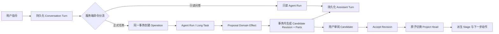

# 剧本 Agent / 项目 API v2

> 状态：当前唯一服务端运行时契约。没有 v1 服务端路由兼容层，没有项目迁移接口，没有旧 Document 写入链路；历史前端快照字段的只读解码边界见 5.2。
>
> 对话重写说明：原生 Conversation/Turn/Snapshot/cursor API 已成为唯一剧本页面运行链路；Phase 4 已删除旧页面 SSE、通用 Writing chunk 分支和 long-task conversation 兼容接口。Project/Operation/Revision/Head 契约继续保留，收口顺序由 [`purra-screenplay-refactor-charter.md`](purra-screenplay-refactor-charter.md) 定义。

## 1. 设计结论

剧本业务只保留四类核心对象：

- `Project`：项目聚合根，持有 revision、生命周期与当前工作阶段；
- `Operation`：一次明确的 Agent 业务命令及其执行状态；
- `Revision`：不可变的阶段产物快照；
- `Project Head`：某个 Deliverable 当前生效的 Revision。

`Working Copy` 仅用于用户手工编辑。它不是历史版本，也不能直接成为当前产物；发布后生成一个不可变 Candidate Revision，再由 Accept 原子切换 Head。

Agent 工具产生的 `screenplay.document_proposal` 是事务内的瞬时 Domain Effect，不是第二份持久化文档。Run Repository 在同一提交边界中把它转换为 Candidate Revision，并只持久化 `screenplay.revision_ready` 引用。对话历史只保存 Revision 引用，不保存 Proposal 全文副本。

## 2. 单一业务流



不可省略的规则：

1. 启动 Operation 时必须提供 `expectedProjectRevision`；
2. 所有命令接口必须提供 `Idempotency-Key`；
3. Agent 产物只允许由已归属 Project 的 Run、Artifact 或 Long Task 完成投影；
4. Revision 内容由一个主 `document` Part 和零到多个 `episode/scene/reviewIssueGroup` Part 组成；
5. Accept 只切换 Head，不复制 Revision，不生成“再次保存”版本；
6. 上游 Head 变化时，下游 Head 在同一事务中失效；
7. 历史列表来自 Revision 与 Acceptance Event，不来自可变 Document 状态；
8. 断线、重放或重复请求只能返回同一命令回执，不能产生重复 Candidate。

## 3. 聚合模型

### 3.1 Project

```ts
type ScreenplayProject = {
  id: string
  revision: number
  title: string
  format: 'shortFilm' | 'featureFilm' | 'singleEpisode' | 'series' | 'verticalSeries'
  source:
    | { type: 'original' }
    | { type: 'book'; bookId: string; bookTitle: string; scope: SourceScope }
  brief: { approach: string; premise: string }
  lifecycle: 'active' | 'archived'
  stage: 'orientation' | 'brief' | 'structure' | 'scenes' | 'draft' | 'review' | 'completed'
  createdAt: string
  updatedAt: string
}
```

数据库中 `source_snapshot_json IS NOT NULL` 是原生项目的不变量。初始化时发现不满足该条件的旧剧本项目会被定向删除。

### 3.2 Deliverable 与 Head

固定角色：

- `sourceAnalysis`（仅改编项目）；
- `creativeBrief`；
- `structure`；
- `sceneList`；
- `screenplayDraft`；
- `review`。

每个角色只有一个 Deliverable。`screenplay_project_heads` 保存每个 Deliverable 当前生效的 Revision；没有 Head 表示该阶段尚未被接受，或已被上游变更失效。

### 3.3 Revision

```ts
type ScreenplayRevision = {
  id: string
  projectId: string
  deliverableId: string
  role: DeliverableRole
  revisionNo: number
  parentRevisionId: string | null
  inputRevisions: Partial<Record<DeliverableRole, string>>
  contentDigest: string
  parts: RevisionPart[]
  sources: SourceRef[]
  operationId: string | null
  rootRunId: string | null
  finalizingRunId: string | null
  createdBy: 'agent' | 'user'
}
```

Revision 一经创建不可修改。正文的分集内容、场景执行记录和审阅分组全部存入 `screenplay_revision_parts`，不存在独立的旧分集表或可变文档正文。

### 3.4 Operation

Operation 状态：

```text
queued -> running -> succeeded
                  -> failed
                  -> canceled
running <-> paused
```

Operation 在创建 Agent Run 之前落库。Run、Work Item、Artifact、Long Task 与最终 Revision 都绑定同一个 Operation，恢复时不依赖对话文本推断业务状态。

## 4. Workspace 读模型

`GET /api/screenplay/v2/projects/{projectId}/workspace` 返回页面一次渲染所需的业务状态：

```ts
type ScreenplayWorkspace = {
  project: ScreenplayProject
  workflow: {
    stage: ScreenplayProject['stage']
    heads: Record<DeliverableRole, RevisionSummary | null>
    nextActions: NextAction[]
  }
  deliverables: Deliverable[]
  candidates: Array<RevisionSummary & { applicability: 'current' | 'stale' }>
  activeOperations: OperationSummary[]
  workingCopies: WorkingCopy[]
}
```

前端不得根据对话消息、旧 Document status 或本地缓存自行推导 Stage、Head、Candidate 是否可应用。

## 5. 公共接口

所有路径以 `/api/screenplay/v2` 为前缀。

### 5.1 项目与会话

```http
GET    /projects?includeArchived=false
POST   /projects
GET    /projects/{projectId}/workspace
PATCH  /projects/{projectId}
POST   /projects/{projectId}/archive
POST   /projects/{projectId}/restore
POST   /projects/{projectId}/delete

PUT    /projects/{projectId}/agent-sessions/current
GET    /projects/{projectId}/agent-sessions?includeClosed=false
POST   /projects/{projectId}/agent-sessions
```

创建、修改、生命周期变更、删除和新建会话均使用幂等命令。删除是 Project 聚合范围内的硬删除，会同时删除其会话、Run 关联、Operation、Revision、Parts、Heads、Receipts、Artifact 与 Long Task；不会删除来源 Book。

### 5.2 Conversation

```http
POST /projects/{projectId}/conversation/turns
GET  /projects/{projectId}/conversation/snapshot?sessionId={sessionId}
GET  /projects/{projectId}/conversation/events?sessionId={sessionId}&after={cursor}
POST /conversation/turns/{turnId}/cancel
POST /conversation/turns/{turnId}/resume
```

Conversation Snapshot 协议 v2 只序列化 `rootRunId`。前端只在读取历史缓存时接受
协议 v1 的 `plannerRunId`，并在单一反序列化边界立即转换为 `rootRunId`；服务端与新的
前端持久化都不再输出旧字段。SQLite 的 `planner_run_id` 仅作为兼容物理列保留，不代表
独立 Planner Run。

只读问答提交：

```json
{
  "sessionId": 12,
  "content": "解释当前人物关系，不要修改项目",
  "runtime": {
    "apiKey": "runtime-only-secret",
    "apiProvider": "openai",
    "options": { "model": "example-model" }
  }
}
```

正式阶段按钮在同一个请求中附带宿主类型化的 `stageCommand`。前端不创建 Operation，也不通过长篇固定文案代替命令边界：

```json
{
  "sessionId": 12,
  "content": "按当前结构生成场景表",
  "stageCommand": {
    "kind": "stage_action",
    "action": "create",
    "targetRole": "sceneList",
    "scope": { "kind": "current_stage" }
  },
  "runtime": {
    "apiKey": "runtime-only-secret",
    "apiProvider": "openai",
    "options": { "model": "example-model" }
  }
}
```

提交先原子持久化 User Turn 与可选 `stageCommand`。执行阶段由统一 Planner 补全 instruction；Planner 结果必须与命令的 action、targetRole 和 scope 精确相容，并通过 Resolver 的权威项目状态校验后，服务端才创建唯一 Operation。API key、原始 provider URL 均不落库，只保存脱敏 runtime profile。执行恢复从 Turn/Operation 读取业务输入，客户端只需通过 resume 重新提供 runtime 凭据。

Snapshot 是界面事实源，cursor event 只负责通知 Snapshot 已失效。事件订阅断开只移除订阅者，不取消 Turn、Run 或 Operation；取消必须调用 cancel 命令。普通咨询必须保持 Operation、Candidate 与 Revision 数量为零。

普通咨询仍可调用经过项目范围校验的只读工具，以核对当前 Project、已接受 Revision 和来源材料；它不能调用任何提案工具。正式 Operation 才获得提案权限及阶段 Artifact 协议。两种路径使用不同的宿主指令，普通对话不会再收到正式交付物的机械提交流程。

同一 Session 同时只允许一个 queued/running Turn。页面不保存未提交的发送队列；正在执行时，用户必须等待完成或显式取消。只有 completed Turn 进入后续模型历史，failed/canceled Turn 仍保留在 Snapshot 中供用户查看，但不会污染模型上下文。

Turn 的 `attempt` 表示当前请求的执行次数。进程或 lease 中断后，恢复会保留 User 内容，清空旧 Run 引用、半截 Assistant 内容和未完成 Revision 引用，然后以新的 Core Run 开始下一次 attempt。Core 中的旧 Run 审计不删除。

Conversation event 只包含失效通知元数据；`screenplay.document_proposal` 全文不会写入 Conversation 表或通用 AI wire。候选结果只保存权威 `revisionId`。前端通过 SSE cursor 触发 Snapshot 刷新，低频 HTTP cursor 检查只作为断线兜底。

### 5.3 Operation

```http
POST /projects/{projectId}/operations
GET  /operations/{operationId}
POST /operations/{operationId}/pause
POST /operations/{operationId}/resume
POST /operations/{operationId}/cancel
GET  /operations/{operationId}/events?after=0&limit=100
```

启动请求：

```json
{
  "expectedProjectRevision": 7,
  "targetRole": "sceneList",
  "intent": {
    "type": "generate",
    "scope": {},
    "instruction": "按已接受结构生成场景表"
  },
  "conversation": {
    "sessionId": 12,
    "userMessageId": "message-42"
  }
}
```

### 5.4 Revision 与历史

```http
GET  /revisions/{revisionId}?view=full
GET  /projects/{projectId}/deliverables/{role}/revisions?cursor=&limit=50
POST /projects/{projectId}/revisions/{revisionId}/accept
```

Accept 请求：

```json
{
  "expectedProjectRevision": 9,
  "confirmInvalidation": true
}
```

Accept 的事务必须同时完成：

- 校验 Project revision 与 Candidate 输入链；
- 切换目标 Deliverable Head；
- 删除所有受影响的下游 Heads；
- 写 Acceptance Event、Command Receipt 与 Outbox Event；
- 递增 Project revision；
- 重新派生 Stage 和 `nextActions`。

### 5.5 Working Copy

```http
PATCH /working-copies/{workingCopyId}
POST  /projects/{projectId}/revisions/{revisionId}/working-copy
POST  /working-copies/{workingCopyId}/publish
```

Working Copy 更新使用 `expectedRevision`；从历史 Revision 建立 Working Copy 和发布 Candidate 同时校验 Project revision。发布不会改变 Head，必须经过显式 Accept。

## 6. 幂等、并发与错误

写接口统一使用：

```http
Idempotency-Key: screenplay:<command>:<uuid>
```

服务端保存 `command_id + command_type + request_digest + response`。同 Key 同请求返回原回执；同 Key 不同请求返回 `409`。

并发控制分两层：

- Project 聚合命令校验 `expectedProjectRevision`；
- Working Copy 更新校验 `expectedRevision`。

业务错误：

- `404`：原生 Project、Revision、Working Copy 或 Operation 不存在；
- `409`：revision 冲突、输入链过期、Head 失效、项目归档、活动 Operation 冲突；
- `422`：请求结构、Idempotency-Key 或 Part 内容不合法。

不存在“请迁移旧项目”错误；旧项目不会进入运行时。

## 7. 持久化不变量

以下约束必须由数据库事务和回归测试共同保证：

1. `(project_id, role)` 只有一个 Deliverable；
2. `(deliverable_id, revision_no)` 唯一；
3. Revision 的 `(part_type, part_key)` 和 `(part_type, position)` 唯一；
4. 每个 Project/Deliverable 最多一个 Head；
5. Acceptance command 在 Project 内唯一；
6. 一个 Operation 最多产生一个结果 Revision；
7. Agent Artifact、Long Task、Run 与 Revision 的 Project/Operation 归属必须一致；
8. 原生剧本 Turn 只保存 `revision_id` 引用，不在通用对话或 Turn 中复制产物全文；
9. Source Receipt 在 Run 阶段持久化，Revision 创建时复制为不可变 Source Ref；
10. Project 删除只作用于该 Project 的所有权闭包。

## 8. 旧数据清理策略

当前没有线上环境，因此采用无兼容清理：

- 初始化时删除 `source_snapshot_json IS NULL` 的剧本项目及其所有权闭包；
- 删除旧 `screenplay_documents`、旧分集表、旧来源关联表和迁移审计表；
- 删除 `ai_conversations` 的剧本 Proposal/Revision 字段，剧本历史只认原生 Turn 的 `revision_id`；
- 删除通用 `ai_agent_runs`、`ai_agent_work_items`、`ai_agent_long_tasks`、`ai_agent_artifacts` 的 `operation_id` 列和索引，不复制旧值；
- 不提供迁移 preview、execute、report 或 readiness API；
- 不保留 v1 Router、CRUD、只读模式或前端升级入口。

当前链路不会从 Session、Artifact、Work Item 或 Long Task 猜测 Operation，也不会在投影时自动创建兼容 Operation。正式 Run 必须在创建时带有 `screenplay.operation` RunBinding；Artifact 投影幂等由 `ai_agent_artifact_projections` receipt 表记录。绑定缺失或不匹配一律返回冲突，不收养老数据。

清理范围严格限制在旧剧本业务数据。Book、Outline、Article、人物、世界设定及其他 Agent 数据不属于清理目标。

## 9. 验收标准

- 项目列表、Workspace、会话、Operation、Working Copy、Revision 历史和 Accept 全部只调用 v2；
- 一个 Agent 产物只创建一个 Candidate Revision，重放不增加数量；
- Accept 重放返回同一结果，且不会创建重复 Head 或历史版本；
- 接受上游新 Revision 会原子失效下游 Heads；
- 分集结构、场景表、正文和审阅只从 Revision Parts 读取；
- 重启可以恢复 Run、Operation 与 Long Task，不从聊天文本恢复业务状态；
- 新数据库和清理后的已有数据库都不存在旧剧本表及 `ai_conversations` 的剧本字段；
- 后端全量测试、前端类型检查和关键接口回归全部通过。
