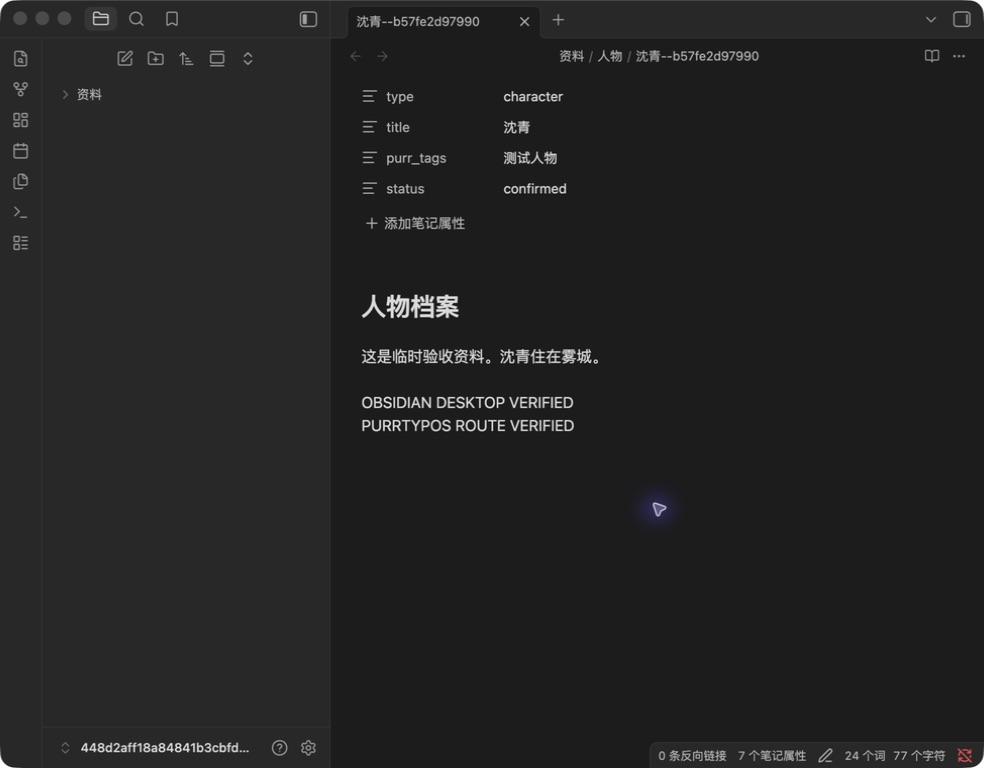

# 共享 Markdown 创作资料验证

日期：2026-09-07。范围：小说人物卡、故事背景、设定资料。正文、手动长期记忆、剧本与 PurrA 未作存储迁移。

## 确定性验证

- 后端全量：`.venv/bin/python -m pytest backend/tests -o addopts='' -q`：**2232 passed in 123.67s**。之后新增完整恢复、纯数据库恢复、存储根目录符号链接用例及目录创建安全修正，再执行共享资料与已有检索定向回归，见下项。
- 最终定向：`test_creation_materials.py` 与 `test_novel_knowledge.py`：**41 passed**，其中共享资料 16 项，已有检索 25 项。
- 共享资料测试涵盖：三类资料同文件读写、外部编辑、过期保存拒绝、事务回滚、发布后失败、发布窗口外部保存、重启恢复、迁移预览/幂等、文件改名/重复/缺失、未知属性/链接/块标识、可恢复删除、工具提案接受与过期拒绝、范围过滤与来源版本失效、跨作品及符号链接隔离、备份文件完整性、完整恢复后保存、纯数据库恢复禁写。
- 前端：`npm run typecheck`、`npm run check:purr-components` 通过；`npm run test:unit` **458 passed**。
- `npm run build:web` 通过。首次受限网络下依赖下载失败；允许联网后打包成功，并在最后目录安全修正后重新构建产物。
- `git diff --check` 通过。
- 第一轮全量有一项既有剧本 20ms 租约用例失败：`test_ready_checkpoint_has_single_apply_owner_and_single_revision_event`；单独重跑通过，后续全量全部通过。没有修改该用例或剧本实现。

这些结果验证程序行为，不证明模型准确性提高。

## Obsidian 实际桌面验证

通过 Computer Use 在已安装的 Obsidian 1.13.7 中打开新建临时 Vault，只操作测试人物文件：

1. Obsidian 成功显示迁移生成的 YAML 属性、人物名称与正文。
2. 在 Obsidian 输入并保存 `OBSIDIAN DESKTOP VERIFIED`。
3. 使用临时数据库调用 PurrTypos 人物读取路由，确认读到该内容。
4. 使用项目人物保存路由及当前 `baseRevision` 追加 `PURRTYPOS ROUTE VERIFIED`。
5. Obsidian 窗口自动显示新增内容。两次修订分别为 `93808f3c6a72793fb90a4a9fb0851f09c8a0573a891d965b7f7e9b5036321797`、`a660a8ae988dc336f5605557b3693e82a5cbf47b9fda4c5a98fe38819945f2aa`。
6. 关闭临时 Vault 验收窗口，保留临时资料供复查。



此项是 **Obsidian UI + 项目后端路由** 双向验收；不是 PurrTypos Electron 全流程验收。

## 尚未验证

- PurrTypos Electron 中从迁移预览、确认、编辑、冲突到 Obsidian 跳转的完整点击流程。
- 真实 Provider 产生提案、作者接受后继续任务的端到端流程，以及真实 Embedding 检索效果/成本。
- 任意外部编辑器及多设备同步产生的全部竞态。当前策略为拒绝冲突并保留修订，不自动合并。

没有使用真实作品迁移，也没有调用真实 Provider 或配置 Embedding。未启动测试 HTTP 服务；现有用户后端未停止或重启。

## 试用

1. 重启 PurrTypos，使其加载本次后端与前端代码。建议先新建测试作品。
2. 打开“创作资料库”，选择“预览本作品资料迁移”。检查清单后点击“确认迁移并启用共享编辑”。如果已经绑定只读目录，先解除原绑定；原笔记不会删除。
3. 在 Obsidian 选择“打开本地仓库”，打开界面显示的 `资料` 目录的上一级文件夹。不要移动该目录或改动 `purr_id` / `purr_kind`。
4. 在两边交替修改人物、背景或设定；项目会在重新读取、重新聚焦及周期刷新时读取文件。遇到过期保存，保留草稿，重新读取后比较。
5. 若需要 Agent 正文检索，请先明确补齐每份资料的章节/知情范围；作者设定讨论可选对应模式。缺失范围不会自动推断为全书公开。资料变更后请发起新 Agent 任务。
6. 使用完整备份保存共享资料。仅数据库备份不再是共享作品的完整备份。

可重复创建完全隔离的临时样本：

```sh
.venv/bin/python scripts/create-shared-materials-fixture.py
```

脚本只新建临时目录，不接受真实作品目录作为目标，也不覆盖当前应用数据库。临时样本记录保存在 `/tmp/purr-shared-materials-fixture.json`。

## 后续：Embedding 可选配置入口

设置页新增“配置 Embedding 服务”开关，默认未配置时关闭并收起表单。不内置或下载模型，不预填模型输出维度。用户自行配置服务后，仍需在作品资料库明确开启语义检索；未配置时保留精确与全文检索。提炼与评审模型移入可选说明，避免被误认为资料检索的必需配置。

本次入口调整：类型检查、组件检查、Web 构建及差异格式检查通过；前端单元测试 458 项、已有资料检索回归 25 项通过。真实 Provider 及该设置流程的 Electron 点击验收未执行。

## 后续：提炼与评审默认跟随当前作品模型（2026-09-08）

设置文案已改为“默认使用当前模型”，单独选择仅作覆盖，清空恢复跟随。小说面板按作品同步模型 ID；后台提炼、评审回调携带作品 ID，不读取其他作品的选择，也不在显式配置失效时擅自换模型。该调整不移除语义记忆组件原有的 Embedding 依赖。

确定性验证：
- 新增模型选择与覆盖回归：作品隔离、当前模型切换、显式覆盖、清空覆盖、无选择/失效覆盖报错、并发回调的作品归属。
- 新增 React hook 行为验证：选择同步、切换作品不会写入上一作品模型、重新挂载恢复偏好。
- 记忆操作、交付与统一记忆定向回归 20 项通过；前端完整单元测试 465 项通过。
- 类型检查、组件边界检查通过。Web 编译通过；首次依赖打包因沙箱网络解析失败，授权联网重试后完整 `build:web` 通过。

本次没有调用真实模型，也未执行 Electron 手动点击验收。后台交付默认读取执行时保存的作品模型；不将其描述为历史任务模型快照。

全量后端回归 `.venv/bin/python -m pytest backend/tests -q` 完成，退出码 0；`git diff --check` 通过。未启动应用开发服务。

## 设置自动保存（2026-09-08）

移除记忆配置保存按钮。提炼/评审模型选择立即保存；Embedding 完整且维度有效时，输入停顿 400ms 或输入框失焦后保存，离开页面前提交已排队的有效草稿。关闭开关清除 Embedding 配置并取消尚未发送的草稿，模型覆盖独立保存。App 以字段补丁串行提交，成功后更新持久状态；失败显示提示，不伪报保存成功。

新增 hook 行为测试覆盖无初始写入、不完整草稿、输入有效后提交、保存回执不重置草稿、关闭取消待发送配置、恢复默认、失败提示及卸载提交。前端单元测试 466 项、类型检查、组件检查通过。浏览器确认保存按钮已移除；自动保存测试使用模拟持久化，未修改真实模型配置或调用真实 Provider。

## 资料面板收敛与 Obsidian 仓库跳转（2026-09-08）

创作资料库只保留共用 Markdown、当前目录和必要状态；范围、Embedding 与模型调用凭据改用统一 `PurrCollapse` 按需展开。资料面板拥有独立纵向滚动容器。Electron 可从共享资料入口派发宿主校验后的 `obsidian://open?path=`，目标为 `资料` 目录的上一级 Vault；浏览器不暴露本地打开按钮。

确定性验证覆盖共享资料导航路径与中文 URI 编码、宿主密钥、主窗口来源校验、URI 白名单和 Electron 派发。浏览器实测滚动容器可视高度 631px、内容高度 2141px、`overflow-y: auto`，折叠项可展开并再次收起。未在该验证中重新启动 Electron，因此“一键打开”按钮的实际 Obsidian 派发仍属于桌面待验项。
