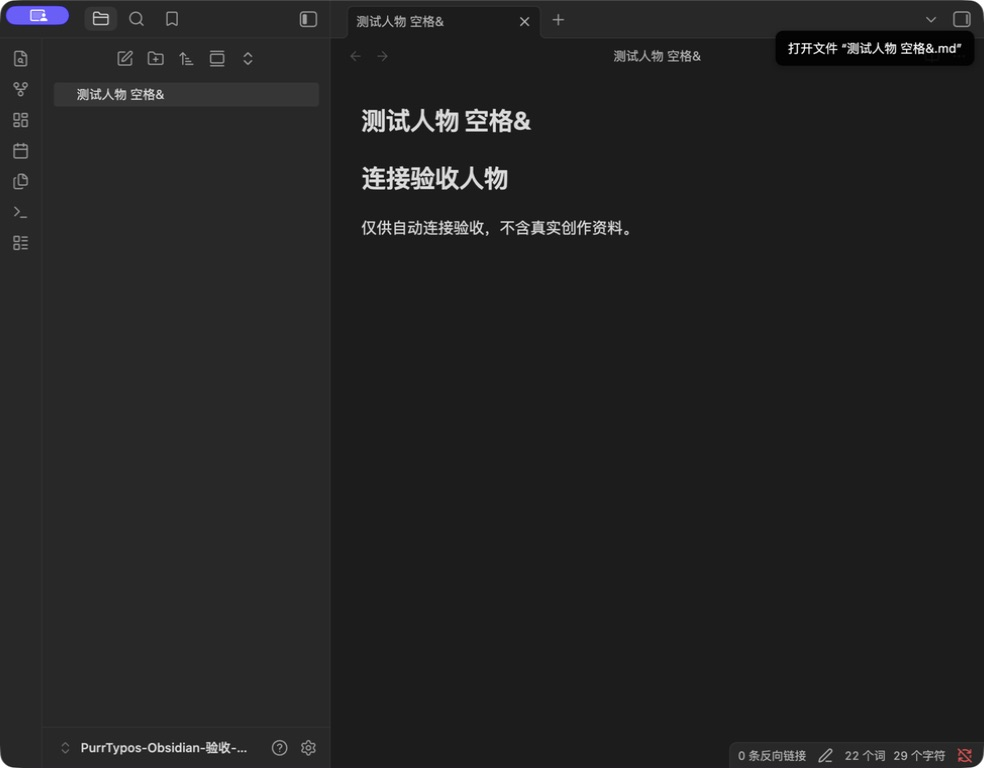

# Obsidian 首次连接修复验证

日期：2026-09-09。

问题：资料目录存在、后端绑定有效，不代表该目录已登记为 Obsidian Vault。原先仅派发 `obsidian://open?path=...`，未登记时 Obsidian 返回 `Vault not found`。

修复：资料库和人物笔记的打开共用 `electron/obsidian_connection.js`。后端提供经过作品归属校验的 `vaultPath`，共享资料取作品资料根目录，外部资料取绑定根目录；renderer 不能提交任意磁盘路径。Electron 优先复用已登记的包含该目录的仓库，以仓库 ID 和相对笔记路径生成 URI。

macOS 首次连接展示一次正常重启确认，正常退出 Obsidian 后重新读取仓库配置，保留所有其他配置和仓库，保存原始字节备份后原子替换。取消、拒绝退出、异常配置和并发变化不会覆盖原配置。不会强制终止进程。macOS 明确启动已安装的 Obsidian，避免挂载安装镜像中的同名应用接收 URI。

该登记实现依赖 Obsidian 本地仓库配置格式，不是官方公开的仓库注册 API；已核对并验证 macOS Obsidian 1.13.7。其他系统支持已有仓库跳转，尚不支持首次自动登记。文件名中的 `#` 被 Obsidian 解释为标题定位，当前明确返回错误，不伪报打开成功。

## 确定性验证

- Electron 连接与 IPC：10 passed，覆盖首次登记、取消、退出失败、保留退出时写回配置、异常配置、路径逃逸、并发和已登记仓库复用。
- 前端完整单元测试：476 passed。
- 后端资料库与共享资料定向测试：44 passed。
- TypeScript 类型检查、Purr Components 边界检查、`git diff --check` 通过。
- 不调用真实生成或 Embedding Provider，不涉及检索准确率结论。

## 实际桌面验证

使用独立 Electron 验收入口调用生产连接模块，创建全新临时目录 `/tmp/PurrTypos-Obsidian-验收-w5Zjtj`，先打开根目录，再打开 `测试人物 空格&.md`。真实 Obsidian 1.13.7 完成登记、正常重启并显示正确笔记正文，未出现 Vault not found。中文、空格及 `&` 路径得到实际验证。

这验证了真实 Electron 连接模块与 Obsidian 的交互，不等于从当前真实作品页面经过整个 IPC 调用链的端到端验收。自动审批拒绝了重新打开当前真实作品的动作，理由是超出临时作品验收范围；未绕过限制。真实作品资料没有在本次修改，尚需重启主应用加载新代码并验收。临时仓库及配置备份保留作验证记录。
